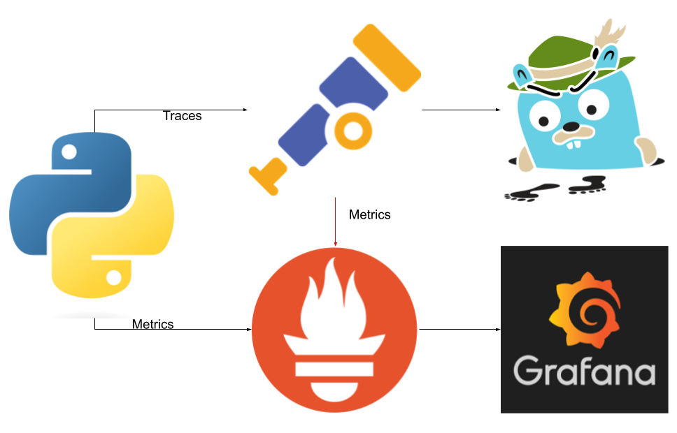

## Class 1 - Essentials
Run python application 
[1. Practice](./exercises/exercise1/)

***infrastructure perspective***
From an infrastructure perspective, this is what we aim to achieve.

## Class 2 - Essentials
Run python application with docker container in the local registry
[2. Practice](./exercises/exercise2/)

## Class 3 - Essentials
Run python application with docker container in the remote registry(Dockerhub)
[3. Practice-3](./exercises/exercise3/)

## Class 4 - Essentials
Run python application in remote registry with Kubernetes
[4. Practice](./exercises/exercise4/)

## Class 5 - Devops
Make the cluster bigger. Adding Prometheous
[5. Practice](./exercises/exercise5/)

## Class 6 - Devops
Make the cluster bigger. Adding Grafana and adding a dashboard
[6. Practice](./exercises/exercise6/)

## Class 7 - SRE Observability Pillars: Metrics, Traces, and Logs

### 1. Metrics
- **Metrics** are numerical values collected over time that measure the performance and health of a system.
- They are essential for identifying trends and detecting problems in the system's behavior before they escalate into incidents.
- Examples of metrics include CPU usage, latency, error rates, and network traffic.
- Metrics are used in conjunction with *Service Level Indicators (SLIs)* and *Service Level Objectives (SLOs)* to monitor and ensure system reliability.

[7. Practice](./exercises/exercise7/)

### 2. Traces
- **Traces** allow tracking the journey of a request through the different services and components of a distributed system.
- Traces are essential for diagnosing issues in microservices architectures where a single request may interact with multiple services.
- They provide visibility into how a transaction flows through the system, helping to identify bottlenecks or inefficiencies.

[8. Practice](./exercises/exercise8/)

Now let's create a metrics based on traces

[9. Practice](./exercises/exercise9/)

### 3. Logs
- **Logs** record detailed events that occur within the system, providing real-time information about its internal state.
- Logs are useful for diagnosing problems at specific moments, containing granular details about errors or particular system states.
- They are often analyzed with tools to detect patterns or anomalies.

Together, these three components (Metrics, Traces, and Logs) form the foundation of **observability**, which is crucial for Site Reliability Engineers (SREs) to maintain system reliability, detect issues, and continuously improve the systems they manage.

## infrastructure perspective
From an infrastructure perspective, this is what we aim to achieve.

------------------------------------------------------------------------------------------------------------------------------------------------------------------------

## Class # - SRE Alerts

## Class # - Terraform
Terraform

## Class # - Devops
Github Actions CI pipeline

## Class # - SRE
Ansible runbook

## Class # - Devops
Helm charts

## Class # - Devops
ArgoCd

