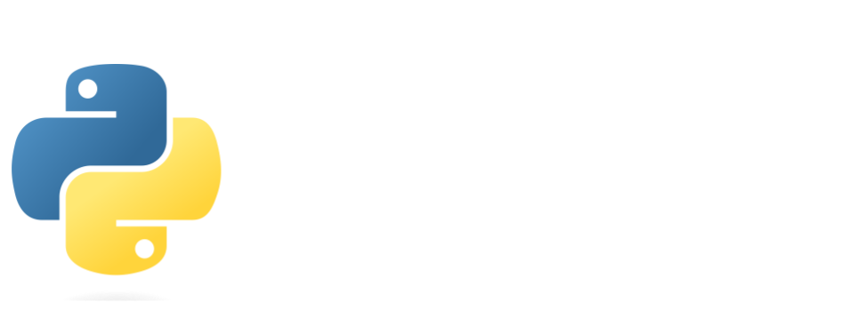
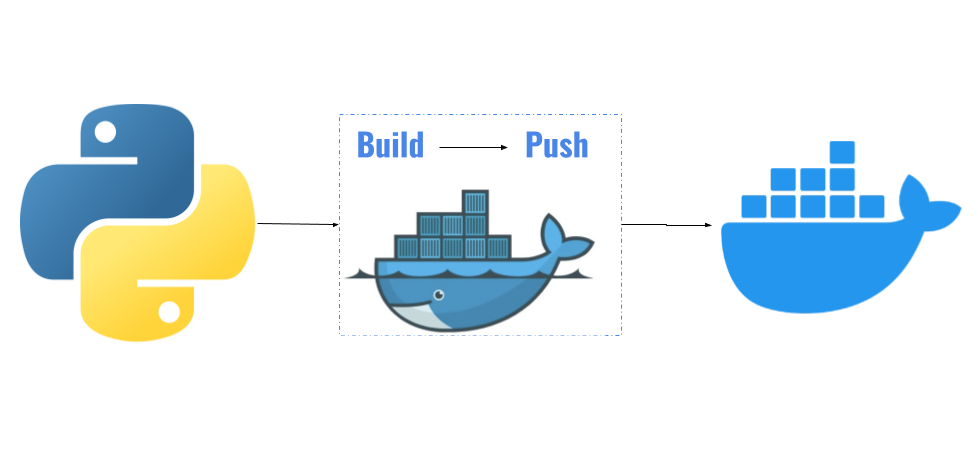
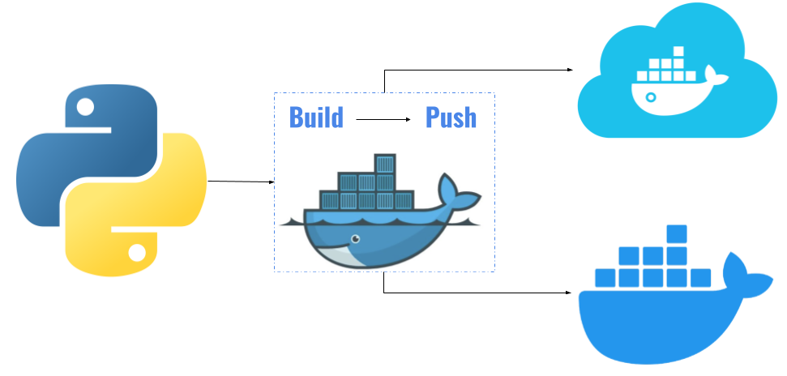
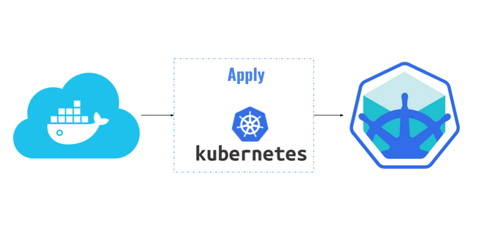
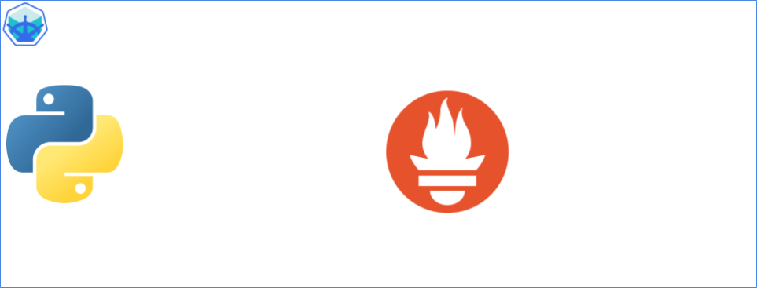
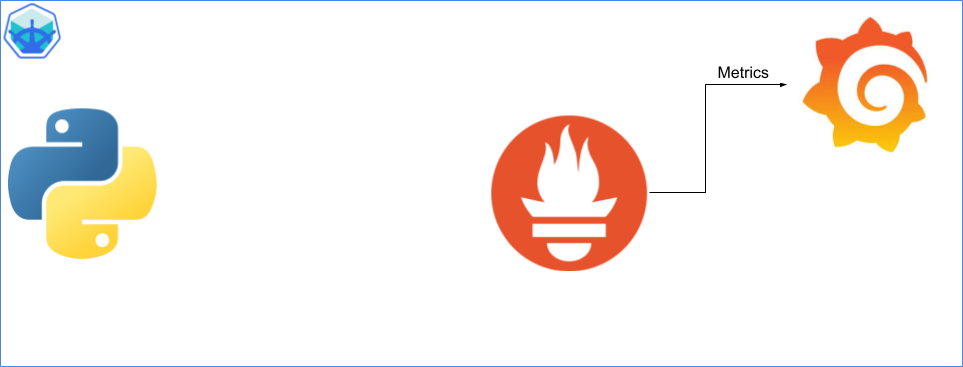
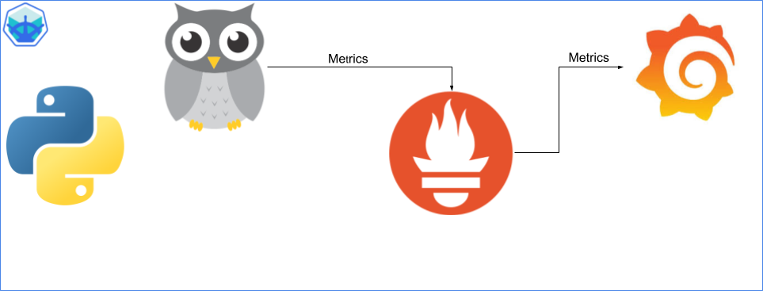
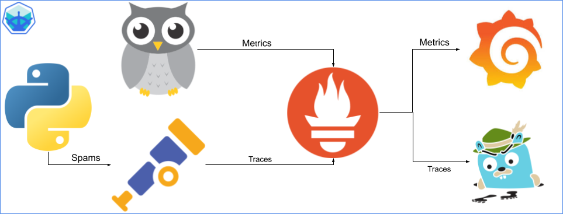
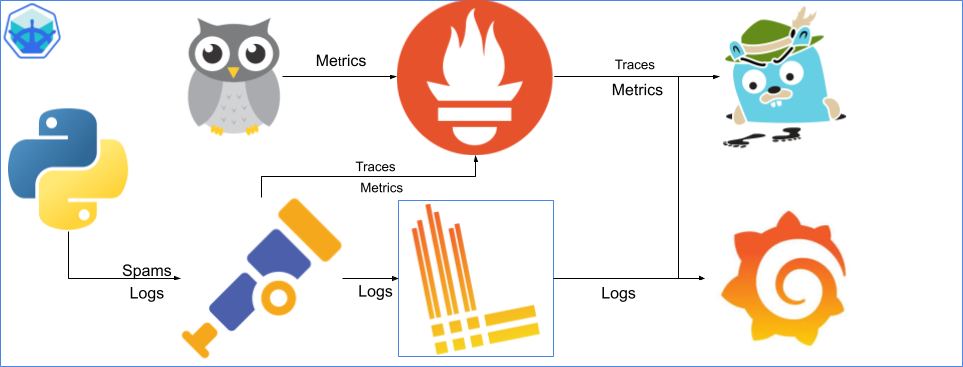

# SRE (Site Reliability Engineering) Process

## Introduction

Site Reliability Engineering (SRE) is a discipline that applies software engineering principles to operations to create scalable and highly reliable systems. The SRE process focuses on balancing the need for reliability with the pace of innovation. This document outlines the key practices, principles, and workflows involved in the SRE process.

## Table of Contents
1. [Software Development Lifecycle (SDLC)](#software-development-lifecycle-sdlc)
2. [Core Principles](#core-principles)
3. [Defining Service Level Objectives (SLOs)](#defining-service-level-objectives-slos)
4. [Monitoring and Incident Management](#monitoring-and-incident-management)
5. [Operational Readiness Reviews (ORR)](#operational-readiness-reviews-orr)
6. [Change Management and Automation](#change-management-and-automation)
7. [Cost Optimization](#cost-optimization)
8. [Continuous Improvement](#continuous-improvement)

---

## Software Development Lifecycle (SDLC)

The **Software Development Lifecycle (SDLC)** is a structured approach to software development. It involves multiple phases that ensure software is designed, developed, tested, and deployed systematically. SRE plays a critical role in ensuring the reliability and scalability of the systems throughout the SDLC.

<details>
<summary>Practice 1 - Let's create a Python App</summary>
> [!TIP] 
> Apply these changes [1. Practice](./exercises/exercise1/) to create a python REST API.This application will serve as a practical case to demonstrate the integration of SRE at each phase, from planning to maintenance, including the implementation of SLOs, monitoring of metrics, and deployment automation.
> 
</details>

> [!TIP] 
<details>
<summary>Practice 2 - Let's create a Dockerize the application</summary>
Apply these changes [2. Practice](./exercises/exercise2/) to achieve the application will be packaged into a Docker image to facilitate easier deployment in multiple locations.

</details>

> [!TIP] 
> Apply these changes [3. Practice](./exercises/exercise3/) the image will be stored in a remote registry(Dockerhub) to use it as the source for the application during deployments.
> 

SRE integrates with SDLC during the deployment and maintenance phases, ensuring smooth releases and reliable operations post-deployment. This process involves proactive monitoring, incident management, and automation to minimize downtime and maintain high availability.

## Core Principles

SRE is guided by several core principles that shape how operations are managed:

- **Emphasize Reliability**: Ensure that systems maintain high availability and performance.

In this session, a Kubernetes cluster can be used to run our application with 3 replicas so that if one fails, the other 2 can take over the load, thus increasing the availability of the service.
> [!TIP] 
> Apply these changes [4. Practice](./exercises/exercise4/) to achieve an infrastructure like this one:
> 

- **Use SLIs and SLOs**: Define and track Service Level Indicators (SLIs) and Service Level Objectives (SLOs) to measure reliability.
- **Blameless Postmortems**: Learn from failures without blaming individuals, focusing on how systems can be improved.
- **Automate Operations**: Use automation to reduce manual interventions and improve system scalability.

## Defining Service Level Objectives (SLOs)

Service Level Objectives (SLOs) are key metrics that define the expected performance and availability of a service. They are derived from **Service Level Indicators (SLIs)**, which measure system behavior.

### Key Steps:
1. **Identify Key Metrics**: Define SLIs based on customer experience (e.g., latency, uptime, error rates).
2. **Set SLO Targets**: Establish acceptable thresholds for SLIs (e.g., 99.9% uptime over a quarter).
3. **Monitor SLOs Continuously**: Use monitoring tools to ensure adherence to these objectives.
4. **Negotiate SLOs with Stakeholders**: Ensure alignment between business needs and engineering efforts.

## Monitoring and Incident Management

Monitoring is crucial for detecting issues early and responding swiftly to incidents.

### Best Practices:
- **Set Up Monitoring Systems**: Tools like Prometheus, Grafana, and OpenTelemetry provide insights into system performance using **metrics**, **traces**, and **logs**.

In this section, a **Prometheus** server is installed on the node that will eventually be used as a repository for traces and metrics.
> [!TIP] 
> Apply these changes [5. Practice](./exercises/exercise5/) to achieve an infrastructure like this one:
> 

In this section, a **Grafana** server is installed, which will allow data visualization from different sources, in this case, Prometheus. Eventually, it will be used to deploy an observability and monitoring strategy.
> [!TIP] 
> Apply these changes [6. Practice](./exercises/exercise6/) to achieve an infrastructure like this one:
> 


   - **Metrics**: Quantitative data points such as CPU usage, memory consumption, and request rates.
> [!TIP] 
> Apply these changes [7. Practice](./exercises/exercise7/) to achieve an infrastructure like this one:
> 


  - **Traces**: Record the journey of requests as they flow through different services, useful for diagnosing performance bottlenecks.
> [!TIP] 
> Apply these changes [8. Practice](./exercises/exercise8/) to achieve an infrastructure like this one:
> 

  - **Logs**: Detailed records of system events that provide context and historical information during incidents.
> [!TIP] 
> Apply these changes [10. Practice](./exercises/exercise10/) to achieve an infrastructure like this one:
> 

- **Golden Signals**: Monitoring should focus on four critical **Golden Signals** to track the health of a service:
  
  1. **Latency**: The time it takes to service a request.
  2. **Traffic**: The amount of demand or load being placed on the system (e.g., requests per second).
  3. **Errors**: The rate of failed requests.
  4. **Saturation**: How full a service's resources are, such as CPU or memory.

- **Define Alerts**: Use alerts based on SLIs, metrics, traces, and logs to notify teams of potential problems before they affect customers.
  
- **Incident Response**: When issues occur, follow a clear incident management process to resolve them quickly:
  1. **Detect the issue** using Golden Signals, monitoring, and alerting systems.
  2. **Respond to the alert** and acknowledge the incident.
  3. **Mitigate the problem** using workarounds or rollbacks to minimize customer impact.
  4. **Document the incident** for review and postmortem analysis.

## Operational Readiness Reviews (ORR)

Operational Readiness Reviews ensure that services are ready for production deployment. ORRs evaluate the robustness of infrastructure, the maturity of monitoring, and the ability to handle failures.

### Checklist for ORR:
- Ensure service has monitoring and alerting in place.
- Review the capacity plan and ensure scaling capabilities.
- Confirm all dependencies are resilient to failures.
- Review disaster recovery strategies.
  
## Change Management and Automation

Automating repetitive tasks and following structured change management processes helps reduce risk during deployments.

### Key Automation Practices:
- **Infrastructure as Code (IaC)**: Use tools like Terraform or Kubernetes for automated infrastructure management.
- **CI/CD Pipelines**: Implement continuous integration and continuous delivery pipelines to deploy changes in a controlled manner.
- **Automate Rollbacks**: Set up automated rollback strategies for failed deployments.
- **Perform Chaos Engineering**: Test system resilience by simulating failures in a controlled way.

## Cost Optimization

SRE focuses not only on reliability but also on ensuring efficient use of resources.

### Strategies:
- **Autoscaling**: Adjust resources dynamically based on demand.
- **Capacity Planning**: Regularly review resource utilization and plan for growth.
- **Optimize Cloud Usage**: Ensure cloud services are provisioned based on actual needs.

## Continuous Improvement

SRE processes should continuously evolve based on feedback and lessons learned from incidents and performance reviews.

### Key Activities:
- **Blameless Postmortems**: Conduct post-incident reviews to identify root causes and improvements.
- **Regularly Review SLOs**: Ensure that SLOs remain aligned with business needs.
- **Invest in Tooling**: Continuously improve monitoring, alerting, and automation systems.


---------------------------------------------------------------------------------------------------------------------------

Pending
Terraform
Runbooks
Ansible
AngoDC
Helm charts
CI/CD

   ```bash
   cd exercises3
   podman login docker.io
   podman build -t cguillenmendez/sre-abc-training-python-app:latest .
   podman build -t cguillenmendez/sre-abc-training-python-app:0.0.0 .
   podman push cguillenmendez/sre-abc-training-python-app:latest
   podman push cguillenmendez/sre-abc-training-python-app:0.0.0
   ```

 
   ```bash
   cd exercises8
   podman login docker.io
   podman build -t cguillenmendez/sre-abc-training-python-app:latest .
   podman build -t cguillenmendez/sre-abc-training-python-app:0.0.1 .
   podman push cguillenmendez/sre-abc-training-python-app:latest
   podman push cguillenmendez/sre-abc-training-python-app:0.0.1
   ```


   ```bash
   cd exercises10
   podman login docker.io
   podman build -t cguillenmendez/sre-abc-training-python-app:latest .
   podman build -t cguillenmendez/sre-abc-training-python-app:0.0.23 .
   podman push cguillenmendez/sre-abc-training-python-app:latest
   podman push cguillenmendez/sre-abc-training-python-app:0.0.23
   ```

