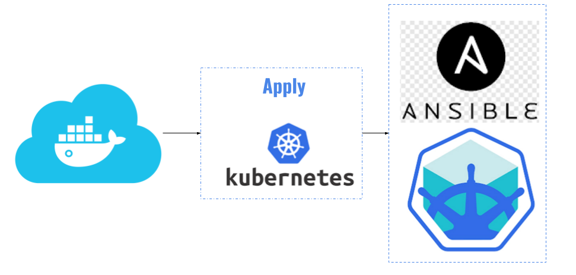
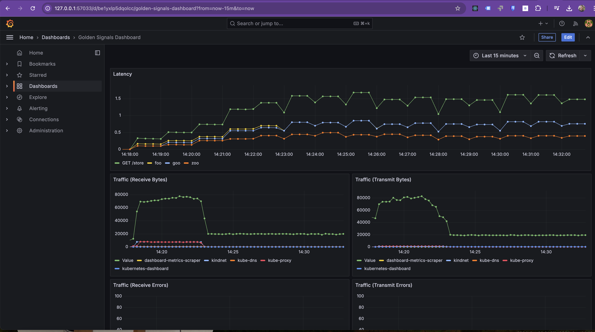
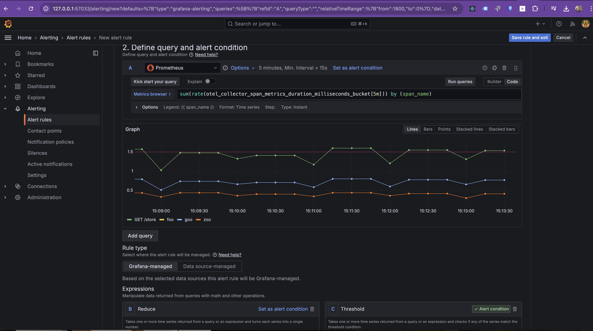
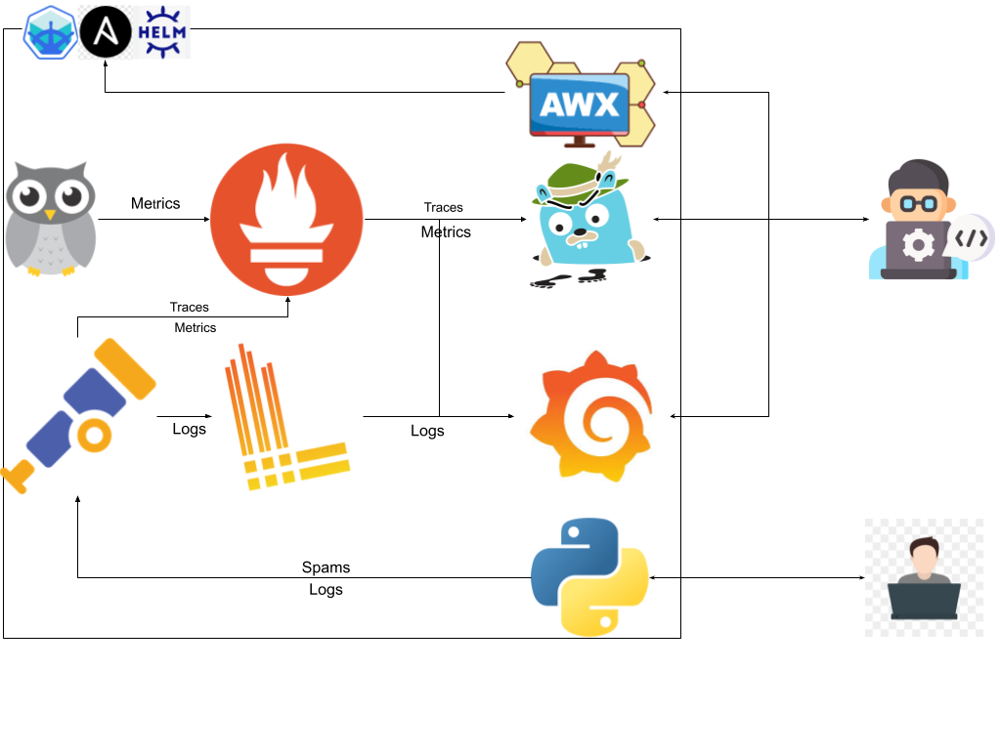

# SRE (Site Reliability Engineering) Process

---

## Introduction

Site Reliability Engineering (SRE) is a discipline that applies software engineering principles to operations to create scalable and highly reliable systems. The SRE process focuses on balancing the need for reliability with the pace of innovation. This document outlines the key practices, principles, and workflows involved in the SRE process.

---

## Getting Started

Before beginning any practice or exercise, clone this repository to your local machine using the following command:

```bash
git clone https://github.com/cguilencr/sre-abc-training.git
cd sre-abc-training
```

This ensures you have access to all the required files and directory structures needed to complete the exercises.

---

## Table of Contents
1. [Software Development Lifecycle (SDLC)](#software-development-lifecycle-sdlc)
2. [Core Principles](#core-principles)
3. [SLIs, SLOs, SLAs, and Error Budgets](#slis-slos-slas-and-error-budgets)
4. [Monitoring and Incident Management](#monitoring-and-incident-management)
5. [Operational Readiness Reviews (ORR)](#operational-readiness-reviews-orr)
6. [Change Management and Automation](#change-management-and-automation)
7. [Cost Optimization](#cost-optimization)
8. [Continuous Improvement](#continuous-improvement)

---

## Software Development Lifecycle (SDLC)

The **Software Development Lifecycle (SDLC)** is a structured approach to software development. It involves multiple phases that ensure software is designed, developed, tested, and deployed systematically. SRE plays a critical role in ensuring the reliability and scalability of the systems throughout the SDLC.

<details>
<summary style="color: green;">
    <a href="exercises/exercise1/" style="color: green; text-decoration: none;">
        :pencil2: 
        Practice #1 - Python app
    </a>
</summary>

> Apply these changes [1. Practice](./exercises/exercise1/) to create a python REST API.This application will serve as a practical case to demonstrate the integration of SRE at each phase, from planning to maintenance, including the implementation of SLOs, monitoring of metrics, and deployment automation.
> 
> 
</details>

<details>
<summary style="color: green;">
    <a href="exercises/exercise2/" style="color: green; text-decoration: none;">
        :pencil2: 
        Practice #2 - App packaged as image 
    </a>
</summary>

> Apply these changes [2. Practice](./exercises/exercise2/) to achieve the application will be packaged into a Docker image to facilitate easier deployment in multiple locations.
> 
> 
</details>

<details>
<summary style="color: green;">
    <a href="exercises/exercise3/" style="color: green; text-decoration: none;">
        :pencil2: 
        Practice #3 - App image ni to a registry
    </a>
</summary>

> Apply these changes [3. Practice](./exercises/exercise3/) the image will be stored in a remote registry(Dockerhub) to use it as the source for the application during deployments.
> 
> 
</details>

SRE integrates with SDLC during the deployment and maintenance phases, ensuring smooth releases and reliable operations post-deployment. This process involves proactive monitoring, incident management, and automation to minimize downtime and maintain high availability.

## Core Principles

SRE is guided by several core principles that shape how operations are managed:

- **Emphasize Reliability**: Ensure that systems maintain high availability and performance.

  In this session, a Kubernetes cluster can be used to run our application with 3 replicas so that if one fails, the other 2 can take over the load, thus increasing the availability of the service.
  <details>
  <summary style="color: green;">
      <a href="exercises/exercise4/" style="color: green; text-decoration: none;">
          :pencil2: 
          Practice #4 - Running the app as a service
      </a>
  </summary>

  > Apply these changes [4. Practice](./exercises/exercise4/) to achieve an infrastructure like this one:
  > 
  > 
  </details>

- **Use SLIs and SLOs**: Define and track Service Level Indicators (SLIs) and Service Level Objectives (SLOs) to measure reliability.
- **Blameless Postmortems**: Learn from failures without blaming individuals, focusing on how systems can be improved.
- **Automate Operations**: Use automation to reduce manual interventions and improve system scalability.

  <details>
  <summary style="color: green;">
      <a href="exercises/exercise4.1/" style="color: green; text-decoration: none;">
          :pencil2: 
          Practice #4.1 - Running the app as a service
      </a>
  </summary>

  > Apply these changes in [Practice 4.1](./exercises/exercise4.1/) to use an Infrastructure as Code (IaC) approach to automate infrastructure setup with Ansible, instead of running commands directly in the shell.
  > 
  > 
  </details>

## SLIs, SLOs, SLAs, and Error Budgets

Service Level Objectives (SLOs) are key metrics that define the expected performance and availability of a service. They are derived from **Service Level Indicators (SLIs)**, which measure system behavior.

### Key Steps:

1. **Service Level Indicator (SLI)**: A metric that measures specific system performance attributes, such as latency, availability, or error rate.

2. **Service Level Objective (SLO)**: A target for acceptable performance of an SLI, e.g., 99.9% availability. SLOs aim to balance reliability and development speed.

3. **Service Level Agreement (SLA)**: A formal agreement with customers defining expected performance and penalties for unmet objectives.

4. **Error Budget**: The allowable margin for failure within an SLO, which provides flexibility for feature development without excessive risk.

<details>
  <summary style="color: green;">
      <a href="exercises/topic0/" style="color: green; text-decoration: none;">
          :chart_with_upwards_trend: 
          SLO´s list
      </a>
  </summary>

  > Create a list of 4 SLO´s to eventually use in the observability strategy. This is an [example](./exercises/topic0#service-level-objectives-slos). Consider adding a new SLO based on the percentile of HTTP request latencies. Percentiles are used to measure how often certain performance thresholds are met for a majority of users. For instance, a 95th percentile latency of 100ms means that 95% of requests are served within 100ms, offering a realistic view of user experience by focusing on the performance seen by the majority of requests, rather than average or extreme cases alone.

  </details>

### White-Box Monitoring and SLOs

In white-box monitoring, metrics, traces, and logs are the primary data sources for monitoring **Service Level Indicators (SLIs)**, ensuring that **Service Level Objectives (SLOs)** are met. For example:
   - **Metrics** measure uptime and latency, forming the basis for availability and performance SLOs.
   - **Traces** reveal the journey of each request, ensuring SLOs related to request latency are achieved.
   - **Logs** provide additional context for errors and anomalies, supporting SLO adherence by enabling detailed investigations when issues arise.

## Monitoring and Incident Management

Monitoring is crucial for detecting issues early and responding swiftly to incidents.

### Best Practices:
- **Set Up Monitoring Systems**: Tools like Prometheus, Grafana, and OpenTelemetry provide insights into system performance using **metrics**, **traces**, and **logs**.

  In this section, a **Prometheus** server is installed on the node that will eventually be used as a repository for traces and metrics.
  <details>
  <summary style="color: green;">
      <a href="exercises/exercise5/" style="color: green; text-decoration: none;">
          :pencil2: 
          Practice #5 - Including Prometheus in the cluster
      </a>
  </summary>

  > Apply these changes [5. Practice](./exercises/exercise5/) to achieve an infrastructure like this one:
  > 
  > 
  </details>

  In this section, a **Grafana** server is installed, which will allow data visualization from different sources, in this case, Prometheus. Eventually, it will be used to deploy an observability and monitoring strategy.
  <details>
  <summary style="color: green;">
      <a href="exercises/exercise6/" style="color: green; text-decoration: none;">
          :pencil2: 
          Practice #6 - Including Grafana in the cluster
      </a>
  </summary>

  > Apply these changes [6. Practice](./exercises/exercise6/) to achieve an infrastructure like this one:
  > 
  > 
  </details>

   - **Metrics**: Quantitative data points such as CPU usage, memory consumption, and request rates.
      <details>
      <summary style="color: green;">
          <a href="exercises/exercise7/" style="color: green; text-decoration: none;">
              :pencil2: 
              Practice #7 - Sharing node metrics
          </a>
      </summary>

      > Apply these changes [7. Practice](./exercises/exercise7/) to achieve an infrastructure like this one:
      > 
      > 
      </details>

  - **Traces**: Record the journey of requests as they flow through different services, useful for diagnosing performance bottlenecks.
      <details>
      <summary style="color: green;">
          <a href="exercises/exercise8/" style="color: green; text-decoration: none;">
              :pencil2: 
              Practice #8 - Sharing app traces
          </a>
      </summary>

      > Apply these changes [8. Practice](./exercises/exercise8/) to achieve an infrastructure like this one:
      > 
      > 
      </details>
      <details>
      <summary style="color: green;">
          <a href="exercises/exercise9/" style="color: green; text-decoration: none;">
              :pencil2: 
              Practice #9 - Creating Metrics from Traces
          </a>
      </summary>

      > Apply these changes [9. Practice](./exercises/exercise9/) to achieve an infrastructure like this one:
      > 
      > 
      </details>

  - **Logs**: Detailed records of system events that provide context and historical information during incidents.
      <details>
      <summary style="color: green;">
          <a href="exercises/exercise10/" style="color: green; text-decoration: none;">
              :pencil2: 
              Practice #10 - Sharing app logs
          </a>
      </summary>

      > Apply these changes [10. Practice](./exercises/exercise10/) to achieve an infrastructure like this one:
      > 
      > 
      </details>

- **Golden Signals**: Monitoring should focus on four critical **Golden Signals** to track the health of a service:
  
  1. **Latency**: The time it takes to service a request.
  2. **Traffic**: The amount of demand or load being placed on the system (e.g., requests per second).
  3. **Errors**: The rate of failed requests.
  4. **Saturation**: How full a service's resources are, such as CPU or memory.

  <details>
  <summary style="color: green;">
      <a href="exercises/exercise11/" style="color: green; text-decoration: none;">
          :pencil2: 
          Practice #11 - Dashboard creation
      </a>
  </summary>

  > Apply these changes [11. Practice](./exercises/exercise11/):
  > 
  > 
  </details>

- **Define Alerts**: Use alerts based on SLIs, metrics, traces, and logs to notify teams of potential problems before they affect customers.

  <details>
  <summary style="color: green;">
      <a href="exercises/exercise12/" style="color: green; text-decoration: none;">
          :pencil2: 
          Practice #12 - Alerts definition
      </a>
  </summary>

  > Apply these changes [12. Practice](./exercises/exercise12/) to create alerts like these onces for each [SLO](#slis-slos-slas-and-error-budgets) define above:
  > 
  > 
  </details>
  
- **Incident Response**: When issues occur, follow a clear incident management process to resolve them quickly:
  1. **Detect the issue** using Golden Signals, monitoring, and alerting systems.
  2. **Respond to the alert** and acknowledge the incident.
  3. **Mitigate the problem** using workarounds or rollbacks to minimize customer impact.
  4. **Document the incident** for review and postmortem analysis.
  <details>
  <summary style="color: green;">
      <a href="exercises/topic1/" style="color: green; text-decoration: none;">
          :pencil2: 
           Time to Detect, Time to Acknowledge and Time to Resolve
      </a>
  </summary>
  
  > These metrics are important for measuring the performance of the SRE (Site Reliability Engineering) team. By monitoring these metrics, an SRE team can efficiently plan and improve its performance: 
  </details>

  <details>
  <summary style="color: green;">
      <a href="exercises/exercise13/" style="color: green; text-decoration: none;">
          :pencil2: 
          Practice #13 - Automate runbooks with ansible.
      </a>
  </summary>

   > Apply these changes [13. Practice](./exercises/exercise13/)  to achieve an infrastructure like this one:
   > 
   > 
   > 
   > In this setup, SREs are responsible for ensuring reliability using tools like Grafana, Jaeger, and AWX, while customers interact with the application.
  </details>


  <details>
  <summary style="color: green;">
        <a href="exercises/topic3/" style="color: green; text-decoration: none;">
            :chart_with_upwards_trend: 
            Syntetic Monitoring
        </a>
    </summary>

    > Previously, Ansible was used to automate a task. Now, you must use it to create a synthetic monitor that simulates a browser accessing the endpoint. To achieve this, you need to create an Ansible script that runs on AWX and connects to the endpoint, ensuring the status code is 200.
  </details>

## Operational Readiness Reviews (ORR)

Operational Readiness Reviews ensure that services are ready for production deployment. ORRs evaluate the robustness of infrastructure, the maturity of monitoring, and the ability to handle failures.

### Checklist for Operational Readiness Review (ORR):
- Ensure service has monitoring and alerting in place.
- Review the capacity plan and ensure scaling capabilities.
- Confirm all dependencies are resilient to failures.
- Review disaster recovery strategies.


<details>
  <summary style="color: green;">
      <a href="exercises/topic2/" style="color: green; text-decoration: none;">
          :chart_with_upwards_trend: 
          ORR
      </a>
  </summary>

  > Previously, in [section 4: SLOs](https://github.com/cguillencr/sre-abc-training#slis-slos-slas-and-error-budgets), a list of 4 SLOs was created. Now, based on the information in the [Operational Readiness Review (ORR)](https://github.com/cguillencr/sre-abc-training/tree/main/exercises/topic2), please attach the results of a review conducted by you in the same document.

  </details>

 
## Change Management and Automation

Automating repetitive tasks and following structured change management processes helps reduce risk during deployments.

### Key Automation Practices:
- **Infrastructure as Code (IaC)**: Use tools like: Helm Charts Terraform or Kubernetes for automated infrastructure management.
    <details>
    <summary style="color: green;">
        <a href="exercises/exercise14/" style="color: green; text-decoration: none;">
            :pencil2: 
            Practice #14 - Helm Charts
        </a>
    </summary>

    > Apply these changes [14. Practice](./exercises/exercise14/):
    > 
    > 
    </details>
    <details>
    <summary style="color: green;">
        <a href="exercises/exercise15/" style="color: green; text-decoration: none;">
            :pencil2: 
            Practice #15 - Terraform PENDING
        </a>
    </summary>

    > Apply these changes [15. Practice](./exercises/exercise15/):
    > 
    > 
    </details>

- **CI/CD Pipelines**: Implement continuous integration and continuous delivery pipelines to deploy changes in a controlled manner.
    <details>
    <summary style="color: green;">
        <a href="exercises/exercise16/" style="color: green; text-decoration: none;">
            :pencil2: 
            Practice #17 -  Github actions PENDING
        </a>
    </summary>

    > Apply these changes [17. Practice](./exercises/exercise14/):
    > 
    > 
    </details>
    <details>
    <summary style="color: green;">
        <a href="exercises/exercise18/" style="color: green; text-decoration: none;">
            :pencil2: 
            Practice #18 -  Argo CD PENDING
        </a>
    </summary>

    > Apply these changes [18. Practice](./exercises/exercise14/):
    > 
    > 
    </details>

- **Automate Rollbacks**: Set up automated rollback strategies for failed deployments.

  <details>
  <summary style="color: green;">
      <a href="exercises/exercise19/" style="color: green; text-decoration: none;">
          :pencil2: 
          Practice #18 -  Kubernetes rollabck PENDING
      </a>
  </summary>

  > Apply these changes [19. Practice](./exercises/exercise14/):
  > 
  > 
  </details>

- **Perform Chaos Engineering**: Test system resilience by simulating failures in a controlled way.
  <details>
  <summary style="color: green;">
      <a href="exercises/exercise20/" style="color: green; text-decoration: none;">
          :pencil2: 
          Practice #20 - PENDING
      </a>
  </summary>

  > Apply these changes [20. Practice](./exercises/exercise14/):
  > 
  > 
  </details>

## Cost Optimization

SRE focuses not only on reliability but also on ensuring efficient use of resources.

### Strategies:
- **Autoscaling**: Adjust resources dynamically based on demand.
- **Capacity Planning**: Regularly review resource utilization and plan for growth.
- **Optimize Cloud Usage**: Ensure cloud services are provisioned based on actual needs.

## Continuous Improvement

SRE processes should continuously evolve based on feedback and lessons learned from incidents and performance reviews.

### Key Activities:
- **Blameless Postmortems**: Conduct post-incident reviews to identify root causes and improvements.
- **Regularly Review SLOs**: Ensure that SLOs remain aligned with business needs.
- **Invest in Tooling**: Continuously improve monitoring, alerting, and automation systems.


---------------------------------------------------------------------------------------------------------------------------

Pending
Terraform
Runbooks
Ansible
AngoDC
Helm charts
CI/CD

   ```bash
   cd exercises3
   podman login docker.io
   podman build -t cguillenmendez/sre-abc-training-python-app:latest .
   podman build -t cguillenmendez/sre-abc-training-python-app:0.0.0 .
   podman push cguillenmendez/sre-abc-training-python-app:latest
   podman push cguillenmendez/sre-abc-training-python-app:0.0.0
   ```

 
   ```bash
   cd exercises8
   podman login docker.io
   podman build -t cguillenmendez/sre-abc-training-python-app:latest .
   podman build -t cguillenmendez/sre-abc-training-python-app:0.0.1 .
   podman push cguillenmendez/sre-abc-training-python-app:latest
   podman push cguillenmendez/sre-abc-training-python-app:0.0.1
   ```


   ```bash
   cd exercises10
   podman login docker.io
   podman build -t cguillenmendez/sre-abc-training-python-app:latest .
   podman build -t cguillenmendez/sre-abc-training-python-app:0.0.23 .
   podman push cguillenmendez/sre-abc-training-python-app:latest
   podman push cguillenmendez/sre-abc-training-python-app:0.0.23
   ```

