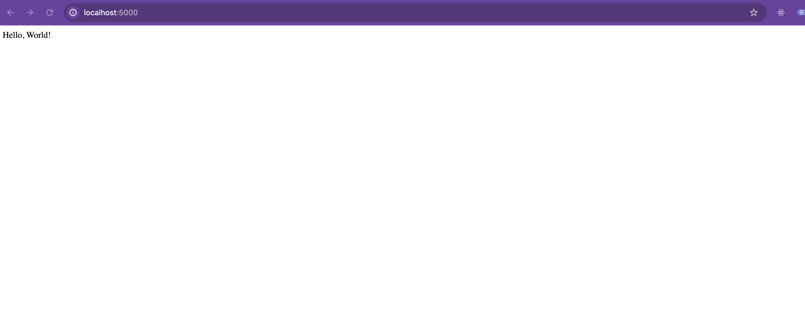

# Table of Contents
- [Introduction](#introduction)
- [Prerequisites](#prerequisites)
- [Install Flask](#install-flask)
- [Code Explanation](#code-explanation)
- [Running the App](#running-the-app)
- [Run the Application](#run-the-application)
- [Final Objective](#final-objective)


# Simple Flask Server Application
In this class, you will learn how to run a simple server application using Python and Flask.

## Prerequisites

Ensure you have Python installed on your system. You can verify this by running:

```bash
python3 --version
```

## Install Flask
Flask is a lightweight WSGI web application framework in Python. To install Flask, use pip:
```bash
pip3 install Flask
```

## Code Explanation
The code creates a Flask application with two main endpoints:

A root endpoint (/) that returns a "Hello, World!" message.
An endpoint for retrieving store information (/store).
### Code Breakdown
```python
from flask import Flask, request

app = Flask(__name__)
```
- **Importing Flask**: This imports the Flask class from the flask library.
- **Initializing the App**: app = Flask(__name__) creates an instance of the Flask application, named after the current file’s name.
```python
@app.route('/')
def hello_world():
    return 'Hello, World!'

```
- **Root Route (/)**: This is a basic endpoint that listens on the root (/) URL. When accessed, it returns a plain text message, "Hello, World!".
```python
stores = [
    {
        "name": "My Store",
        "items": [
            {
                "name": "Chair",
                "price": 15.99
            }
        ]
    }
]

```
- **Stores Data**: This is a simple data structure representing a store. The store contains an array of items, with each item represented by its name and price.

```python
@app.get('/store') # 'http://127.0.0.1:5000/store'
def get_stores():
    return {"stores": stores}
```
- **Get Stores Route** (/store): This endpoint returns a JSON object containing all stores. The @app.get('/store') decorator defines this route, making it accessible via a GET request.
- **Response**: When this endpoint is accessed, it returns the stores list as a JSON object.


```python
if __name__ == '__main__':
    app.run(host='0.0.0.0', port=5000)
```
- **Running the App**: This conditional statement checks if the script is run directly (rather than imported as a module). If it is, the Flask application starts up, listening on all network interfaces (0.0.0.0) at port 5000.


To run the Flask application, execute the following command from your terminal:
## Run the application

```bash
python3 classes/class1/app.py
```

---
# Final Objective
At the end of this document, you should accomplished this:
> [!IMPORTANT]
> Once the aplication is running, open your web browser and go to `http://127.0.0.1:5000/`. You should see the text "Hello, World!" displayed.
> 
