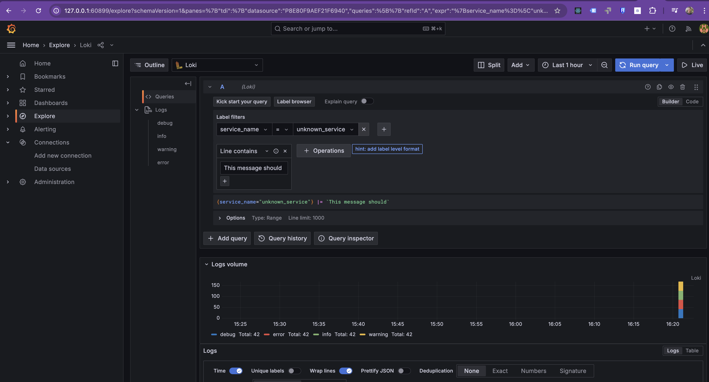

# Application Logging and Observability with OpenTelemetry and Grafana Loki

## Table of Contents

- [Overview](#overview)
- [Deployment](#deployment)
   - [Minikube Logging Directory Setup](#minikube-logging-directory-setup)
- [Tip for Infrastructure as Code (IaC) with Ansible](#tip-for-infrastructure-as-code-iac-with-ansible)
- [Final Objective](#final-objective)
- [Cleanup](#cleanup) 

---

## **Overview**  

In this exercise, we will enable **logging for a Python application** and integrate it with **OpenTelemetry, Loki, and Grafana** to visualize logs. The goal is to capture logs generated by the application, store them in a **shared log volume**, and forward them to **Grafana Loki** for centralized monitoring.

The key components of this setup are:  
- **Python Application Logging**: Writes logs to `/logs/sre-app.log`.  
- **Persistent Storage (PVC + PV)**: Ensures logs are available across multiple containers.  
- **OpenTelemetry Collector**: Reads logs and forwards them to **Loki**.  
- **Grafana Loki**: Stores logs and provides an interface to query them.  
- **Grafana Dashboard**: Visualizes logs and provides insights into errors.  

By the end of this exercise, you will be able to analyze application logs in **Grafana** using Loki as the log backend.


The following configurations correspond to the blue square in the diagram above.

---

## **Navigate to the Directory**  

Before proceeding, navigate to the correct directory using the following command:  

```bash
cd sre-abc-training/exercises/exercise10
```
---

## **Configuring Application Logging with OpenTelemetry**  

### **Modify the Python Application**
   - The Python code will be updated to create logs for various events and actions.
   - These logs will be written to the `./logs/sre-app.log` file for easy access.

```python
...
import logging
from opentelemetry.exporter.otlp.proto.grpc._log_exporter import OTLPLogExporter
from opentelemetry._logs import set_logger_provider
from opentelemetry.sdk._logs import LoggerProvider, LoggingHandler
from opentelemetry.sdk._logs.export import BatchLogRecordProcessor

logger = logging.getLogger(__name__)
logging.basicConfig(filename='./logs/sre-app.log', encoding='utf-8', level=logging.DEBUG)
logger.debug('This message should go to the log file with Debug level')
logger.info('This message should go to the log file with Info level')
logger.warning('This message should go to the log file with Warn level')
logger.error('This message should go to the log file with Err level')

...
def zoo():
    with tracer.start_as_current_span("zoo") as span:
        ...
        logger.info(f"zoo executed with delay: {delay:.2f} seconds")  # Log execution
        return f"zoo executed in {delay:.2f} seconds"

def goo():
    ...

    with tracer.start_as_current_span("goo") as span:
            ...
            logger.info("goo successfully called zoo")  # Log success
            return f"goo called -> {result}"

        except Exception as e:
            ...
            logger.error(f"goo encountered an error: {e}")  # Log the error
            return f"goo encountered an error: {e}"

def foo():
    with tracer.start_as_current_span("foo") as span:
        ...
        logger.info("foo successfully called goo")  # Log success
        return f"foo called -> {result}"
...
Checkout the full example [here](./app.py)

```
### **Adjust the Image to Support Logging**  
   - The Python code will be updated to use the instrumentation-logging library for logs management
   - The folder /app/logs should be created wth the proper permissions 

```dockerfile
...
# Install Flask and OpenTelemetry libraries
RUN pip install flask==3.0.3 \
    opentelemetry-api==1.27.0 \
    opentelemetry-sdk==1.27.0 \
    opentelemetry-exporter-otlp-proto-grpc==1.27.0 \
    opentelemetry-instrumentation-flask==0.48b0 \
    opentelemetry-instrumentation-wsgi==0.48b0 \
    opentelemetry-instrumentation-logging==0.48b0 \
    opentelemetry-exporter-otlp==1.27.0

...

# Ensure the log directory exists
RUN mkdir -p /app/logs

# Make sure the application has write permission to the log file
RUN chmod -R 777 /app/logs
...
```
Checkout the full example [here](./Dockerfile)

### **Publish the New Image**  

```bash
   podman login docker.io
   podman tag local-image-name username/repository-name:tag
   podman push username/repository-name:tag
```
   At least for demostration purposes this is my personal registry with this image
 
```bash
podman login docker.io
podman build -t cguillenmendez/sre-abc-training-python-app:latest .
podman build -t cguillenmendez/sre-abc-training-python-app:0.0.23 .
podman push cguillenmendez/sre-abc-training-python-app:latest
podman push cguillenmendez/sre-abc-training-python-app:0.0.23
```

## **Infrastructure Adjustments**  

### **Application Adjustments** 
   - It will needed to share a folder between the application pod, node folder and otelcollector pod that let's share the logs created by the application. First create a folder in minikube
```bash
  # Create the directory for logs
  sudo mkdir -p /data/sre-app/logs
  
  # Change permissions to make it writable by all users
  sudo chmod 777 /data/sre-app/logs

  # Exit from the Minikube SSH session
  exit

```

   - Then a couple of PersistentVolumes will be required to share the folder between pods

```yaml

apiVersion: v1
kind: PersistentVolume
metadata:
  name: log-pv-1
spec:
  capacity:
    storage: 3Gi
  accessModes:
    - ReadWriteMany
  hostPath:
    path: /data/sre-app/logs # This is where logs are stored on the node
    type: DirectoryOrCreate
  storageClassName: ""  # Explicitly setting storageClassName to empty string
---
apiVersion: v1
kind: PersistentVolume
metadata:
  name: log-pv-2
spec:
  capacity:
    storage: 3Gi
  accessModes:
    - ReadWriteMany
  hostPath:
    path: /data/sre-app/logs # This is where logs are stored on the node
    type: DirectoryOrCreate
  storageClassName: ""  # Explicitly setting storageClassName to empty string

```
Checkout the full example [here](./storage.yaml)

   - The next step is to change the application deployment to use the new image and one of the PersistentVolume create above by using a persistentVolumeClaim

```yaml
...
apiVersion: apps/v1
kind: Deployment
...
spec:
  ...
  template:
  ...
    spec:
      containers:
      - name: sre-abc-training-app
        image: cguillenmendez/sre-abc-training-python-app:0.0.23
        ports:
        - containerPort: 5000
        volumeMounts:
        - name: log-volume
          mountPath: /app/logs  # Mount the shared volume
      volumes:
      - name: log-volume
        persistentVolumeClaim:
          claimName: log-pvc  # Use the shared PVC
---
apiVersion: v1
kind: PersistentVolumeClaim
metadata:
  name: log-pvc
  namespace: application
spec:
  accessModes:
    - ReadWriteMany
  resources:
    requests:
      storage: 3Gi  # Must match the PV's size on storage.log-pv
  storageClassName: ""  # Explicitly setting storageClassName to empty string
  volumeName: log-pv-1  # Explicitly bind to the PV named "log-pv"
...
```
Checkout the full example [here](./deployment.yaml)

### **OpenTelemetry Collector Adjustments**  

   - A new PersistentVolumeClaim will be created at the otelcollector level to share the files with the PersistentVolumes created above
   - Then change the ConfigMap to collect all the files at `sre-app/*.log` using a filelog receiver 
   - And finally create a new `otlphttp/loki` exporter to forward the logs to a Loki repository, which eventually Grafana will use it as a datasource.

```yaml
...
apiVersion: v1
kind: PersistentVolumeClaim
metadata:
  name: log-pvc
  namespace: opentelemetry
spec:
  accessModes:
    - ReadWriteMany
  resources:
    requests:
      storage: 3Gi  # Must match the PV's size on storage.log-pv
  storageClassName: ""  # Explicitly setting storageClassName to empty string
  volumeName: log-pv-2  # Explicitly bind to the PV named "log-pv"
---
apiVersion: apps/v1
kind: Deployment
...
spec:
  replicas: 1
  selector:
    matchLabels:
      app: otel-collector
  template:
    metadata:
      labels:
        app: otel-collector
    spec:
      containers:
          ...
          volumeMounts:
            - name: otel-config
              mountPath: /etc/otel-collector-config.yaml  # Mount the config as a file
              subPath: config.yaml  # This points to the correct key in the ConfigMap
            - name: log-volume
              mountPath: /var/log/sre-app # Mount the shared volume
      volumes:
        ...
        - name: log-volume
          persistentVolumeClaim:
            claimName: log-pvc  # Use the shared PVC
---
apiVersion: v1
kind: ConfigMap
metadata:
  name: otel-config
  namespace: opentelemetry
data:
  config.yaml: |
    receivers:
      otlp:
        protocols:
          grpc:
            endpoint: 0.0.0.0:4317
      filelog:
        include: ["/var/log/sre-app/*.log"]  # Path to the log file
        start_at: beginning # Start reading from the beginning of the files

    exporters:
      otlphttp/loki:
        endpoint: http://loki.opentelemetry.svc.cluster.local:3100/otlp
        tls:
          insecure: true
    ...

    service:
        pipelines:
            logs:
                receivers: [otlp, filelog]
                processors: [batch]
                exporters: [otlphttp/loki]
            ...
```
Checkout the full example [here](./otel-collector.yaml)


### **Grafana Loki Setup**  

   - Grafana Loki will be used as datasource for logs that mean that the otel collector needs to place the logs there in order to let Grafana query them.

   Apply [Lokie deployment](./grafana-loki.yaml) settings

### **Grafana Datasource Configuration**  

   - A new datasource will be created at Grafana that let users query the information at loki.

```yaml
apiVersion: v1
kind: ConfigMap
metadata:
  name: grafana-datasources-config
...
data:
  datasources.yaml: |
    apiVersion: 1
    datasources:
      ...
      - name: Loki
        type: loki
        access: proxy
        url: http://loki.opentelemetry.svc.cluster.local:3100
        isDefault: false
        editable: true
...
```

### **Grafana Dashboard Adjustments**  
   - The Example dashboard will be changed to create a new panel which display only the error logs. Remember that this phrase `goo encountered an error:` was used to mark that part of the code.
   
```yaml
apiVersion: v1
kind: ConfigMap
metadata:
  name: grafana-dashboards-config
  ...
data:
  ...
  example-dashboard.json: |
    {
      "id": null,
      "uid": "example-dashboard",
      "title": "Example Dashboard",
      ...
      "panels": [
        ...,
        {
          "datasource": "Loki",
          "id": 4,
          "gridPos": { "h": 8, "w": 12, "x": 12, "y": 0 },
          "targets": [
            {
              "expr": "{service_name=\"unknown_service\"} |= `goo encountered an error:`",
              "refId": "D"
            }
          ],
          "title": "Error Occurrences for Unknown Service",
          "type": "logs"
        }
      ],
      "schemaVersion": 16,
      "version": 1
    }
```
Checkout the full example [here](./grafana.yaml)

---

## **Deployment**  

Before deploy all the new staff it's important to clean the changes from the previous exercises and then apply the new settings wih short program like this one:

```bash
#!/bin/bash
podman login docker.io
podman build -t cguillenmendez/sre-abc-training-python-app:latest .
podman build -t cguillenmendez/sre-abc-training-python-app:0.0.23 .
podman push cguillenmendez/sre-abc-training-python-app:latest
podman push cguillenmendez/sre-abc-training-python-app:0.0.23

kubectl delete ns application
kubectl delete ns opentelemetry
kubectl delete ns monitoring
kubectl delete pv --all 
kubectl delete pvc --all 
sleep 5;

## Run commands inside Minikube
## Create the directory for logs
# minikube ssh
# sudo mkdir -p /data/sre-app/logs
  
## Change permissions to make it writable by all users
# sudo chmod 777 /data/sre-app/logs

## Exit from the Minikube SSH session
# exit
echo "-------------------------------------------------------------------------"
echo "Start creating"
echo "-------------------------------------------------------------------------"
kubectl apply -f ./storage.yaml;
kubectl apply -f ./deployment.yaml;
kubectl apply -f ./otel-collector.yaml;
kubectl apply -f ../exercise8/jaeger.yaml;
kubectl apply -f ../exercise9/prometheus.yaml;
kubectl apply -f ./grafana-loki.yaml;
kubectl apply -f ./grafana.yaml;
echo "-------------------------------------------------------------------------"
echo "wait"
echo "-------------------------------------------------------------------------"
sleep 10;
kubectl get pods -A
```

## **Minikube Logging Directory Setup**  

Minikube is a local Kubernetes cluster running inside a VM or container. The filesystem of this environment is isolated and ephemeral (i.e., it doesn't persist across Minikube restarts unless explicitly managed).
This means directories like /data/sre-app/logs are not pre-created, and manual intervention is needed to set them up.

```bash
## Run commands inside Minikube
## Create the directory for logs
# minikube ssh
# sudo mkdir -p /data/sre-app/logs
  
## Change permissions to make it writable by all users
# sudo chmod 777 /data/sre-app/logs

## Exit from the Minikube SSH session
# exit
```

---

## **Tip for Infrastructure as Code (IaC) with Ansible**  

> [!TIP]
> A more efficient **Infrastructure as Code (IaC)** approach can be implemented with Ansible to apply the new configuration and start its service in Minikube. An [example](./infra.yaml) of how to structure a YAML playbook to achieve this.

Run the playbook:  

```bash
ansible-playbook -i ../exercise4.1/ansible_quickstart/inventory.ini infra.yaml
minikube service grafana-service -n monitoring
```

---

## **Final Objective**  

By completing this exercise, you should be able to:  
> - View **trace-based logs** in **Grafana**.  
> - Use **Loki** as a centralized logging system.  
> - Identify and filter **error logs** in **Grafana**.  

  

Additionally, you can visualize error occurrences in a **graph format**:  



---

## **Cleanup**  

To remove resources and free up space:  

```bash
kubectl delete ns application opentelemetry monitoring
kubectl delete pv --all 
kubectl delete pvc --all 
```

---