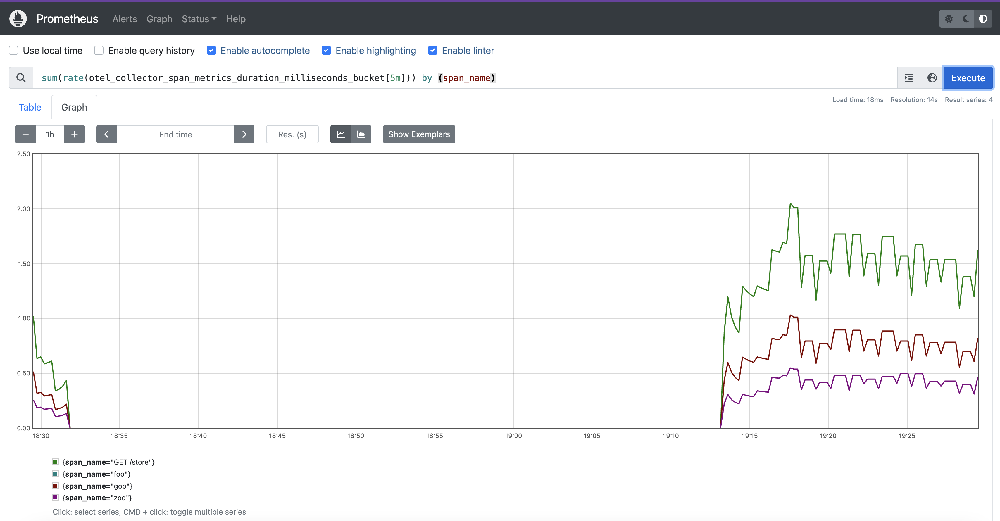
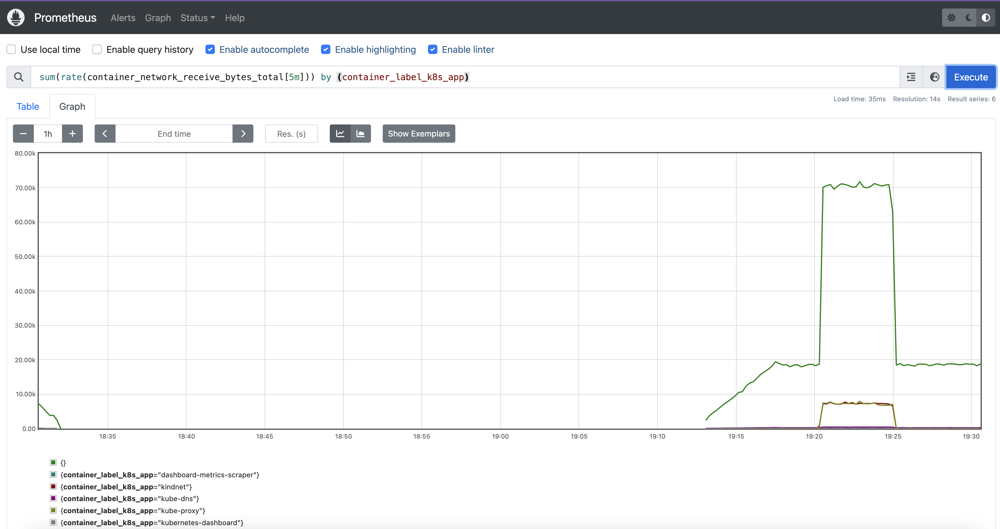
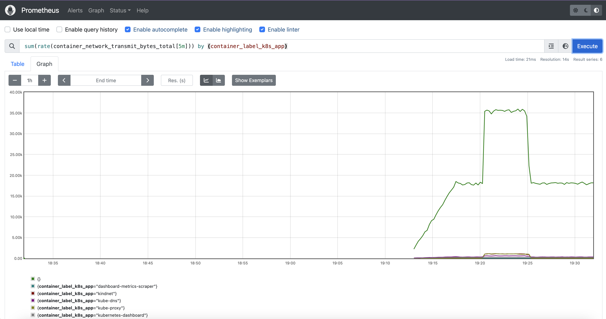
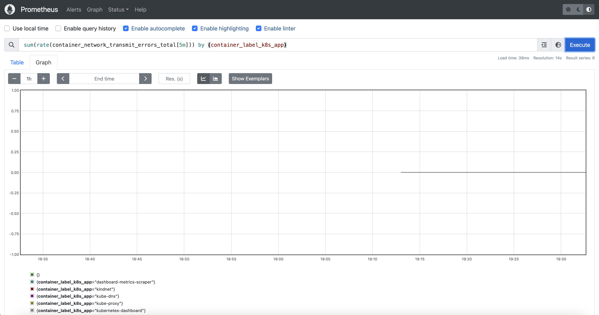
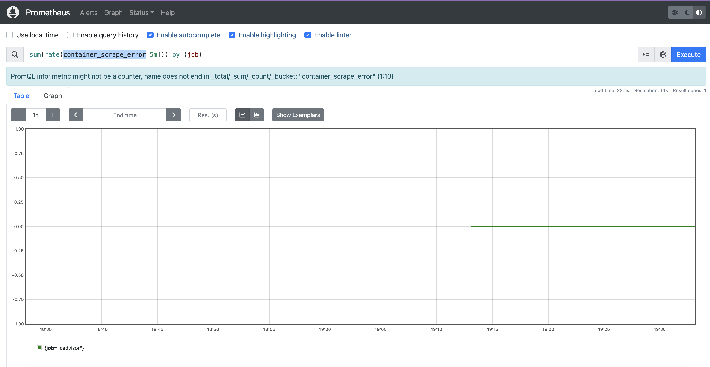
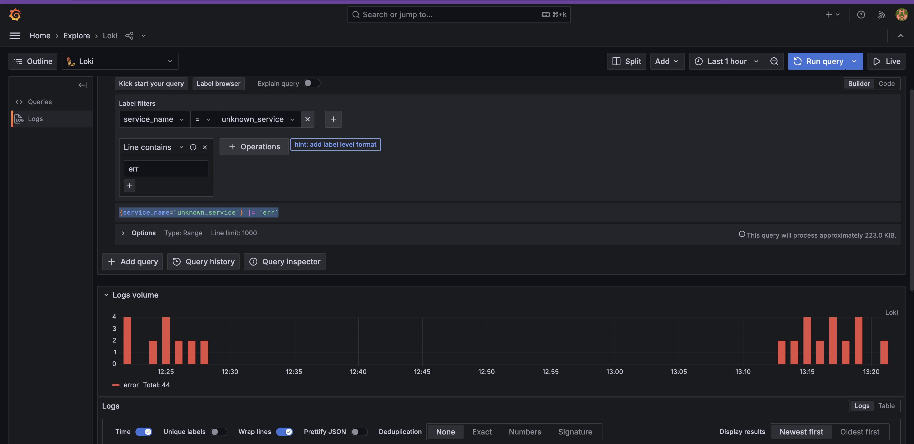
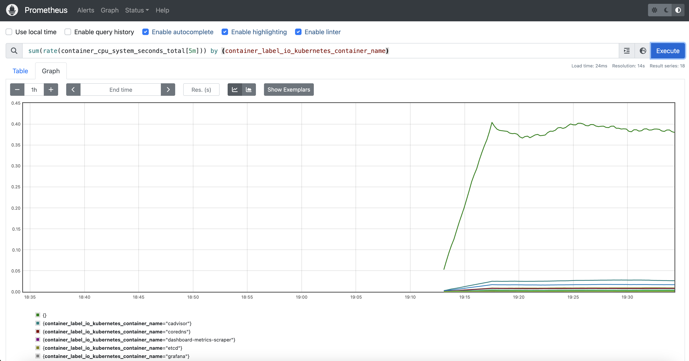
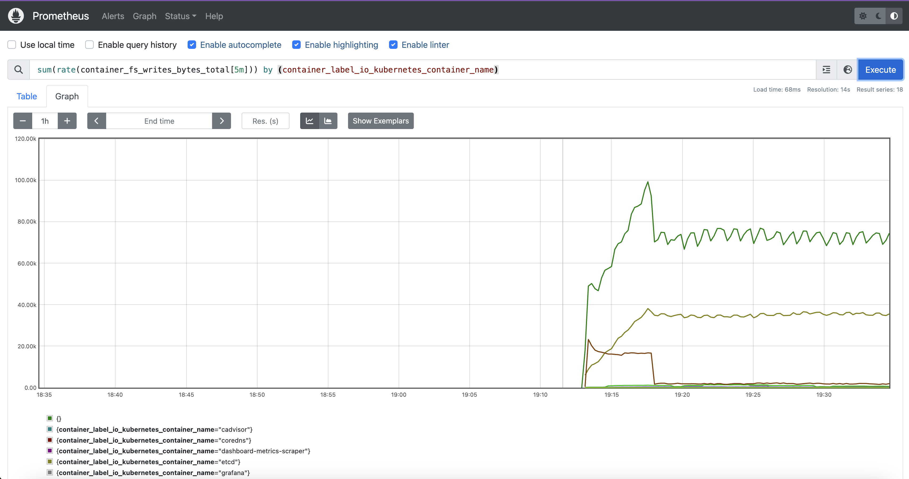
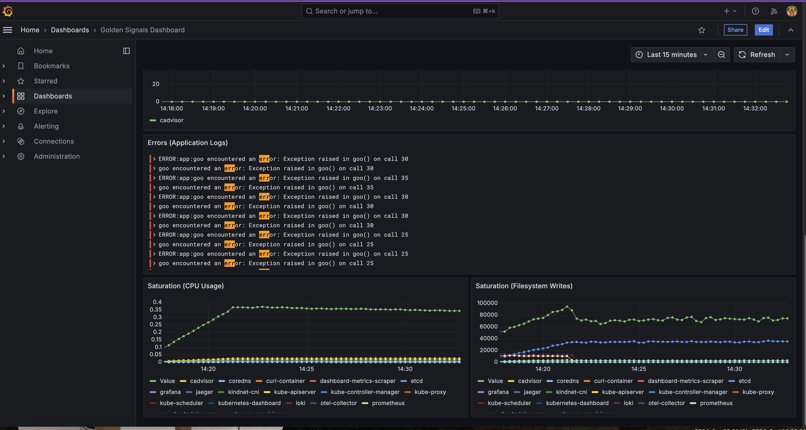

## Observability approach

The **Golden Signals** approach is a fundamental monitoring framework in **Site Reliability Engineering (SRE)**. These signals provide key insights into system health, helping engineers quickly identify, diagnose, and resolve issues in production. Google's SRE teams developed the Golden Signals framework to define a standard set of metrics essential for monitoring system reliability.

## What Are the Golden Signals?

The Golden Signals consist of four primary metrics:

1. **Latency**: The time it takes to service a request. Latency includes both successful and failed requests, with a focus on measuring the time for successful ones as a primary indicator.

  > [!TIP]
  > Create a Granafa panel with `sum(rate(otel_collector_span_metrics_duration_milliseconds_bucket[5m])) by (span_name)` using the `otel_collector_span_metrics_duration_milliseconds_bucket` metric from the Cadvisor service.
  > The output shoud be like this:
  > 

2. **Traffic**: The amount of demand on the system, such as the number of requests per second. Traffic helps SREs understand usage patterns and anticipate scalability needs.

  > [!TIP]
  > Create a Granafa panel with `sum(rate(container_network_receive_bytes_total[5m])) by (container_label_k8s_app) from cadvisor` using the `container_network_receive_bytes_total` metric from the Cadvisor service.
  > The output shoud be like this:
  > 

  > [!TIP]
  > Create a Granafa panel with `sum(rate(container_network_transmit_bytes_total[5m])) by (span_name)` using the `container_network_transmit_bytes_total` metric from the Cadvisor service.
  > The output shoud be like this:
  > 

  > [!TIP]
  > Create a Granafa panel with `sum(rate(container_network_receive_errors_total[5m])) by (span_name)` using the `container_network_receive_errors_total` metric from the Cadvisor service.
  > The output shoud be like this:
  > 

  > [!TIP]
  > Create a Granafa panel with `sum(rate(container_network_transmit_errors_total[5m])) by (span_name)` using the `container_network_transmit_errors_total` metric from the Cadvisor service.
  > The output shoud be like this:
  > 

3. **Errors**: The rate of failed requests. Monitoring error rates allows engineers to see if users are encountering issues, which can be critical for user experience.

  > [!TIP]
  > Create a Granafa panel with `sum(rate(container_scrape_error[5m])) by (job)` using the `container_scrape_error` metric from the Cadvisor service.
  > The output shoud be like this:
  > 

  > [!TIP]
  > Create a Granafa panel with `{service_name=“unknown_service”} |= 'err'` using the logs line with the `err` level 
  > 

4. **Saturation**: The overall capacity and resource usage of the system, such as CPU or memory usage. Saturation helps identify potential bottlenecks before they cause outages.

  > [!TIP]
  > Create a Granafa panel with `sum(rate(container_cpu_system_seconds_total[5m])) by (job)` using the `container_cpu_system_seconds_total` metric from the Cadvisor service.
  > The output shoud be like this:
  > 

  > [!TIP]
  > Create a Granafa panel with `sum(rate(container_label_io_kubernetes_container_name[5m])) by (job)` using the `container_label_io_kubernetes_container_name` metric from the Cadvisor service.
  > The output shoud be like this:
  > 

These signals offer a holistic view of system performance, enabling SREs to quickly address critical reliability issues. Here is a preview of the dashboard 

At [New Dashboard](grafana.yaml) is an example of all Grafana setting which include the new dashboard configuration