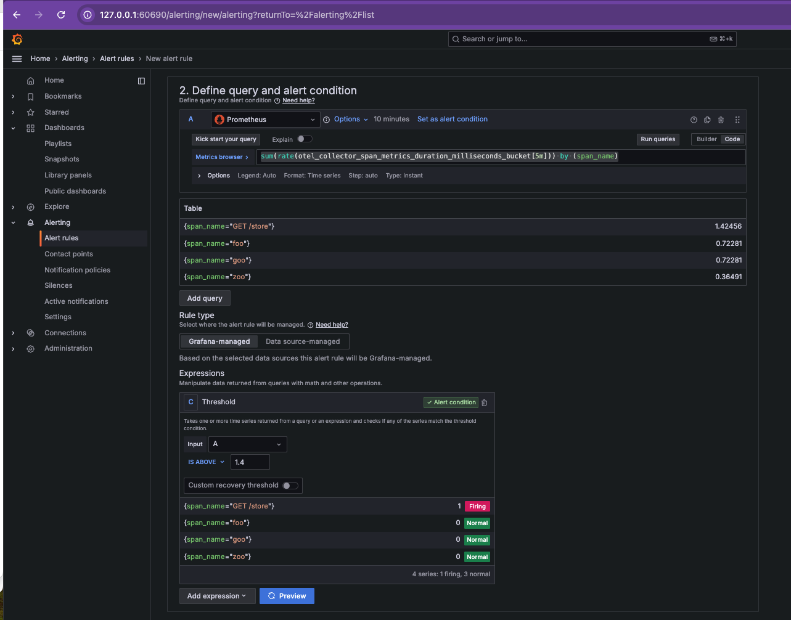

# **Alerting with Grafana: Monitoring Latency and Errors**

## **Table of Contents**

- [Overview](#overview)
- [Loki Configuration for Alerting](#loki-configuration-for-alerting)
- [Creating Alerts in Grafana](#creating-alerts-in-grafana)
  - [1. Configuring Loki for Alerting](#1-configuring-loki-for-alerting)
  - [2. Creating an Alert for the Latency Panel](#2-creating-an-alert-for-the-latency-panel)
  - [3. Creating Additional Alerts Based on SLOs](#3-creating-additional-alerts-based-on-slos)
- [Deployment](#deployment)
- [Tip for Infrastructure as Code (IaC) with Ansible](#tip-for-infrastructure-as-code-iac-with-ansible)
- [Final Objective](#final-objective)
- [Cleanup](#cleanup)

---

## **Overview**

This exercise focuses on **alerting in Grafana** using **Loki** for log-based alerts and **Prometheus metrics** for monitoring **latency** and **errors**.  

The goal is to:  
✅ **Configure Loki's ruler component** to trigger alerts.  
✅ **Create alerts for latency and errors** in the Grafana dashboard.  
✅ **Define alert conditions based on Service Level Objectives (SLOs)**.  
✅ **Send notifications** when thresholds are exceeded.  

  

The following configurations correspond to the **blue square** in the diagram above.  

---

## **Navigate to the Directory**

Before proceeding, navigate to the correct directory:

```bash
cd sre-abc-training/exercises/exercise12
```

---

## **Loki Configuration for Alerting**

Loki is a **log aggregation system** that enables **efficient querying and alerting based on log data**.  
It integrates with **Grafana** to trigger alerts when log patterns match predefined rules.  

🔹 **Why use Loki for alerting?**  
Unlike Prometheus, which focuses on **metrics**, Loki is optimized for **log-based alerts**. This is useful when monitoring **application logs for errors, anomalies, or service degradations**.

### **1. Configuring Loki for Alerting**

To enable alerting in Loki, update its configuration to include **ruler settings**:

```yaml
ruler:
  storage:
    type: local
    local:
      directory: /loki/rules
  rule_path: /tmp/rules/fake/
  alertmanager_url: http://localhost:9093
  ring:
    kvstore:
      store: inmemory
  enable_api: true
```

📌 **Explanation of settings**:  
- **`ruler`** → Enables Loki's alerting functionality.  
- **`storage.local.directory`** → Defines where alerting rules are stored.  
- **`alertmanager_url`** → Sends alerts to **Alertmanager**, which handles notifications.  
- **`enable_api`** → Allows managing alerting rules via the Loki API.  

---

## **Creating Alerts in Grafana**

Grafana alerts notify users when **metrics exceed defined thresholds**.  
Below, we configure alerts for **latency and errors**.

### **2. Creating an Alert for the Latency Panel**

1️⃣ **Open the Latency Panel**:  
   - In **Grafana**, navigate to the **Latency panel**.  

2️⃣ **Edit the Panel**:  
   - Click on the panel title → **Edit**.  

3️⃣ **Go to the Alerts Tab**:  
   - Switch to the **Alerts** tab in the panel editor.  

4️⃣ **Define the Alert Condition**:  
   - Use the following **Prometheus query** to monitor latency:  

   ```promql
   sum(rate(otel_collector_span_metrics_duration_milliseconds_bucket[5m])) by (span_name)
   ```

   - **Set the evaluation period**: **Last 10 minutes**.  

5️⃣ **Configure Expressions**:  
   - **Input (A)**: Use the query above.  
   - **Alert condition**: **Latency is above 1,400 ms** (1.4s).  

6️⃣ **Set Evaluation Behavior**:  
   - **Create a rule folder** (for better organization).  
   - **Set evaluation interval** (how often the alert rule runs).  

7️⃣ **Configure Labels and Notifications**:  
   - Under **Contact point**, choose a **notification channel** (e.g., Slack, Email).  
   - The default channel is `grafana-default-email`.  

8️⃣ **Save the Alert**:  
   - Click **Save** to enable the alert.  

This will trigger a **notification when latency exceeds the defined threshold**, as shown below:



---

### **3. Creating Additional Alerts Based on SLOs**

Following **SLO (Service Level Objective) definitions**, create additional alerts.

🔹 **Alert 1: Endpoint Duration Above 1,400 ms**  

```promql
sum(rate(otel_collector_span_metrics_duration_milliseconds_bucket[5m])) by (span_name)
```

📌 **Trigger Condition**: Alert if response time exceeds **1,400 ms**.

---

🔹 **Alert 2: Low Network Traffic (Below 250,000 Bytes)**  

```promql
sum(rate(container_network_receive_bytes_total[5m])) by (container_label_k8s_app)
```

📌 **Trigger Condition**: Alert if received bytes drop below **250,000 bytes**.

---

🔹 **Alert 3: High Error Rate (> 5,500 Errors)**  

```promql
sum(count_over_time({service_name="unknown_service"} |= "err" [5m])) by (service_name)
```

📌 **Trigger Condition**: Alert if the number of **errors exceeds 5,500**.

---

## **Deployment**

Before applying the new configuration, **clean up previous resources**:

```bash
#!/bin/bash

kubectl delete ns application
kubectl delete ns opentelemetry
kubectl delete ns monitoring
kubectl delete pv --all 
kubectl delete pvc --all 
sleep 5;
echo "-------------------------------------------------------------------------"
echo "Start creating"
echo "-------------------------------------------------------------------------"
kubectl apply -f ../exercise10/storage.yaml;
kubectl apply -f ../exercise10/deployment.yaml;
kubectl apply -f ../exercise10/otel-collector.yaml;
kubectl apply -f ../exercise8/jaeger.yaml;
kubectl apply -f ../exercise9/prometheus.yaml;
kubectl apply -f ./grafana-loki.yaml;
kubectl apply -f ./grafana.yaml;
echo "-------------------------------------------------------------------------"
echo "wait"
echo "-------------------------------------------------------------------------"
sleep 5;
kubectl get pods -A
```

---

## **Tip for Infrastructure as Code (IaC) with Ansible**

> [!TIP]
> A more efficient **Infrastructure as Code (IaC)** approach can be implemented with Ansible.  
> An [example](./infra.yaml) YAML playbook is available to automate deployment.

Run the playbook:

```bash
ansible-playbook -i ../exercise4.1/ansible_quickstart/inventory.ini infra.yaml
minikube service grafana-service -n monitoring
```

---

## **Final Objective**

At the end of this document, you should be able to:  
✅ **Monitor latency and error rates using Grafana**.  
✅ **Define and configure alerts based on SLOs**.  
✅ **Receive notifications when thresholds are exceeded**.  

Here is a preview of the **alerting system in action**:  

  

As the application runs, **alerts will trigger** because the functions `goo`, `foo`, and `zoo` **simulate errors and service degradations**.

---

## **Cleanup**

To remove all resources:

```bash
kubectl delete ns application opentelemetry monitoring
kubectl delete pv --all
kubectl delete pvc --all
```

---