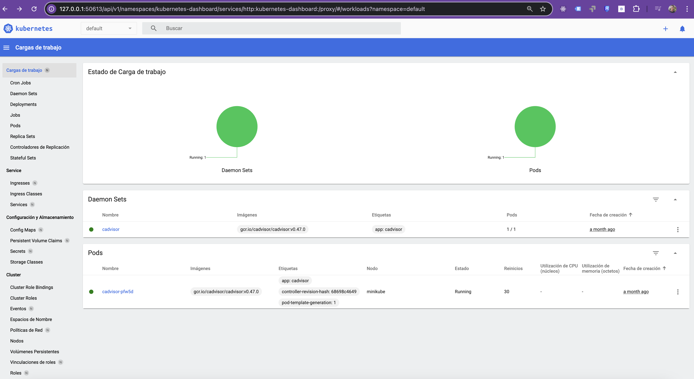

# Deploying a Python Application on Kubernetes Using Minikube

## Table of Contents
- [Introduction](#introduction)
  - [What is Kubernetes?](#what-is-kubernetes)
  - [What is Minikube?](#what-is-minikube)
  - [What is kubectl?](#what-is-kubectl)
  - [What is YAML?](#what-is-yaml)
- [Prerequisites](#prerequisites)
- [Navigate to the Application Directory](#navigate-to-the-application-directory)
- [Install Minikube on macOS](#install-minikube-on-macos)
- [Starting Minikube with Podman](#starting-minikube-with-podman)
- [Accessing the Kubernetes Dashboard](#accessing-the-kubernetes-dashboard)
- [Deploying the Application](#deploying-the-application)
  - [Deployment YAML](#deployment-yaml)
  - [Service YAML](#service-yaml)
  - [Steps to Deploy](#steps-to-deploy)
- [Exploring the Application in the Dashboard](#exploring-the-application-in-the-dashboard)
- [Final Objective](#final-objective)
- [Cleanup](#cleanup)

---

## Introduction

This exercise will guide you through deploying a Python application to Kubernetes using Minikube with Podman as the container runtime. You will configure the deployment, expose the service, and explore the Kubernetes dashboard to observe the running application.

### What is Kubernetes?

Kubernetes (K8s) is an open-source platform that automates the deployment, scaling, and management of containerized applications. It provides a resilient framework to run distributed systems reliably.

#### Key Features:
- **Automatic bin packing**: Allocates resources based on container requirements.
- **Self-healing**: Restarts or replaces containers as needed.
- **Horizontal scaling**: Dynamically scales applications based on demand.
- **Service discovery and load balancing**: Manages traffic routing between applications.
- **Automated rollouts and rollbacks**: Simplifies application updates.

### What is Minikube?

Minikube is a lightweight Kubernetes implementation for local development and testing. It creates a single-node Kubernetes cluster on your local machine, enabling you to learn and experiment with Kubernetes.

#### Why Use Minikube?
- **Simple Setup**: Quickly spin up a Kubernetes environment.
- **Feature Support**: Most Kubernetes features, such as DNS and dashboards, are available.
- **Resource Management**: Manage cluster resources locally without affecting production.

### What is kubectl?

`kubectl` is the command-line tool for interacting with Kubernetes clusters. It allows you to deploy applications, inspect resources, and manage clusters.

#### Common Commands:
- `kubectl get pods`: List all running pods.
- `kubectl apply -f <file.yaml>`: Apply configuration from a YAML file.
- `kubectl delete -f <file.yaml>`: Delete resources defined in a YAML file.

### What is YAML?

YAML (YAML Ain't Markup Language) is a data serialization format used to configure Kubernetes resources. It is human-readable and ideal for defining structured data.

#### Key YAML Concepts:
- **apiVersion**: Defines the Kubernetes API version.
- **kind**: Specifies the resource type (e.g., Deployment, Service).
- **metadata**: Contains resource information like names and labels.
- **spec**: Describes the desired state of the resource.

---

## Prerequisites

Before starting, ensure you have completed Exercises 1–3. Additionally, install the following tools:
- **Podman**
- **Minikube**
- **kubectl**

---

## Navigate to the Application Directory

To begin, navigate to the directory for Exercise 4:

```bash
cd sre-abc-training/exercises/exercise4
```

This directory contains the necessary YAML files for the deployment and service configuration.

---

## Install Minikube on macOS

Install Minikube using Homebrew:

```bash
brew install minikube
```

Verify the installation:

```bash
minikube version
```

---

## Starting Minikube with Podman

Start Minikube with the Podman driver and container runtime:

```bash
minikube start --driver=podman --container-runtime=containerd
```

Verify the setup:

```bash
minikube status
```

---

## Accessing the Kubernetes Dashboard

Launch the Kubernetes dashboard:

```bash
minikube dashboard
```

> **Note:** Open a new terminal for further commands while the dashboard runs.

---

## Deploying the Application

The necessary YAML files for the deployment and service are already present in the `exercise4` directory.

### Deployment YAML

The `deployment.yaml` defines the application's deployment, including replicas and container image.

### Service YAML

The `service.yaml` exposes the application using a NodePort.

### Steps to Deploy

1. Apply the Deployment:
   ```bash
   kubectl apply -f deployment.yaml
   ```

2. Apply the Service:
   ```bash
   kubectl apply -f service.yaml
   ```

3. Verify the Pods:
   ```bash
   kubectl get pods
   ```

4. Verify the Service:
   ```bash
   kubectl get service sre-abc-training-service
   ```

---

## Exploring the Application in the Dashboard

1. Open the Minikube dashboard:
   ```bash
   minikube dashboard
   ```

2. Explore:
   - **Workloads > Deployments**: View the `sre-abc-training-app` deployment, replicas, and status.
   - **Network > Services**: Review the `sre-abc-training-service`, its NodePort, and associated pods.

---

## Final Objective

At the end of this exercise, you should accomplish the following:

> **[IMPORTANT]**  
> Use the Minikube dashboard to inspect the deployment and service. Ensure all pods are running, and the application is accessible.  
> 

---

## Cleanup

After completing the exercise, clean up the resources to keep your environment tidy.

1. **Delete the Deployment**:
   ```bash
   kubectl delete -f deployment.yaml
   ```

2. **Delete the Service**:
   ```bash
   kubectl delete -f service.yaml
   ```

3. **Verify All Resources Are Deleted**:
   ```bash
   kubectl get pods
   ```
   The output should show:
   ```
   No resources found in default namespace.
   ```

By following these steps, your environment will be ready for the next exercise.

---