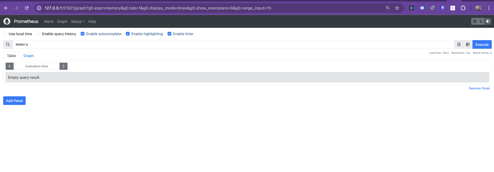

# Deploying Prometheus in Minikube

## Table of Contents
- [Navigate to the Application Directory](#navigate-to-the-application-directory)
- [Overview](#overview)
- [Key Features of Prometheus](#key-features-of-prometheus)
- [Architecture](#architecture)
- [Use Cases](#use-cases)
- [Traditional Installation](#traditional-installation)
- [Prometheus Installation Steps](#prometheus-installation-steps)
  - [Step 1: Namespace Creation](#step-1-namespace-creation)
  - [Step 2: Prometheus Configuration](#step-2-prometheus-configuration)
  - [Step 3: Prometheus Deployment](#step-3-prometheus-deployment)
  - [Step 4: Prometheus Service](#step-4-prometheus-service)
  - [Step 5: Verify Prometheus Configuration](#step-5-verify-prometheus-configuration)
- [Running the Playbook](#running-the-playbook)
- [Final Objective](#final-objective)
- [Cleanup](#cleanup)

---

## Navigate to the Application Directory

To begin, navigate to the directory for Exercise 5:

```bash
cd sre-abc-training/exercises/exercise5
```

> **Note**: This directory contains the necessary YAML files for the deployment and service configuration.

---

## Overview

Prometheus is an open-source systems monitoring and alerting toolkit. This exercise demonstrates deploying Prometheus in Minikube using YAML manifests and automating the process with an Ansible playbook.

---

## Key Features of Prometheus

- **Time Series Data Storage**: Stores data as time series with metric names and key-value pairs.
- **Powerful Query Language**: Allows flexible and efficient data retrieval.
- **Dynamic Service Discovery**: Discovers monitoring targets dynamically.
- **Integrated Alerting**: Built-in support for alert rules and notifications.
- **Visualization**: Includes basic visualization with integration options for Grafana.

---

## Architecture

Prometheus consists of the following components:
- **Prometheus Server**: Collects and stores data.
- **Exporters**: Expose metrics to Prometheus.
- **Alertmanager**: Handles alerts generated by Prometheus.
- **Pushgateway**: For short-lived jobs pushing metrics.
- **Client Libraries**: Instrument applications for custom metrics.

---

## Use Cases

- Infrastructure Monitoring.
- Application Performance Monitoring.
- Alerting for system failures.
- Microservices-based architecture monitoring.

---

## Traditional Installation

This section provides the traditional steps to install Prometheus:

1. Download the latest version from [Prometheus Releases](https://prometheus.io/download/).
2. Unpack the tarball and run the Prometheus binary.
3. Configure the `prometheus.yml` file with the list of targets to monitor.
4. Start Prometheus with the following command:
   ```bash
   ./prometheus --config.file=prometheus.yml
   ```

In this exercise, we’ll focus on deploying Prometheus within a Minikube cluster using Kubernetes YAML configurations.

---

## Prometheus Installation Steps

> **Note**: Before proceeding, ensure that both Minikube and Podman are running. These were set up in previous exercises.

The `prometheus.yaml` file required for this exercise is already included in the directory. You do not need to create this file manually. The file contains configurations for the namespace, ConfigMap, deployment, and service for Prometheus.

---

### Step 1: Namespace Creation

To isolate monitoring tools, create a dedicated namespace in the `prometheus.yaml` file:
```yaml
apiVersion: v1
kind: Namespace
metadata:
  name: monitoring # A separate namespace for all monitoring tools
```

---

### Step 2: Prometheus Configuration

The Prometheus configuration is defined as a ConfigMap in the `prometheus.yaml` file:
```yaml
apiVersion: v1
kind: ConfigMap
metadata:
  name: prometheus-config
  namespace: monitoring
  labels:
    app: prometheus
data:
  prometheus.yml: |
    global:
      scrape_interval: 15s

    scrape_configs:
      - job_name: 'prometheus'
        static_configs:
          - targets: ['localhost:9090']
```

---

### Step 3: Prometheus Deployment

The deployment for Prometheus is specified in the `prometheus.yaml` file:
```yaml
apiVersion: apps/v1
kind: Deployment
metadata:
  name: prometheus-deployment
  namespace: monitoring
  labels:
    app: prometheus
spec:
  replicas: 1
  ...
```

---

### Step 4: Prometheus Service

Expose Prometheus using the following service configuration in the `prometheus.yaml` file:
```yaml
apiVersion: v1
kind: Service
metadata:
  name: prometheus-service
  namespace: monitoring
  labels:
    app: prometheus
spec:
  selector:
    app: prometheus
  ports:
    - protocol: TCP
      port: 9090
      targetPort: 9090
  type: NodePort
```

---

### Step 5: Verify Prometheus Configuration

After ensuring that the `prometheus.yaml` file is correctly set up, run the following commands to deploy Prometheus and expose the service:
```bash
kubectl apply -f prometheus.yaml
```

Verify the status of the Prometheus pods:
```bash
kubectl get pods -n monitoring
```
Ensure that the pods are in the `Running` state. If not, check the logs or events for troubleshooting.

Expose the Prometheus service using Minikube:
```bash
minikube service prometheus-service -n monitoring
```

---

## Running the Playbook

To deploy Prometheus using Ansible:

1. **Clarify the Dependency**  
   Ensure you have completed Exercise 4.1, as this exercise requires the `inventory.ini` file from the `exercise4.1/ansible_quickstart` directory.

2. **Run the Playbook**  
   Execute the following command:
   ```bash
   ansible-playbook -i ../exercise4.1/ansible_quickstart/inventory.ini infra.yaml
   ```

3. **Verify the Prometheus Service**  
   Confirm that the Prometheus service is running:
   ```bash
   minikube service prometheus-service -n monitoring
   ```

---

## Final Objective

At the end of this exercise, you should accomplish the following:

> **Important**  
> Access Prometheus through the exposed service in Minikube. Use the Prometheus interface to query metrics such as `memory`, `CPU`, or `kubernetes`.  
> Example:  
> - Search for metrics like `memory` or `CPU` in the input field.  
> - View the results in table and graph formats.  
> - As Prometheus was recently installed, there may be limited data available.

> **Expected Output**  
> Once successful, you should see a table similar to the following:  
> 

---

## Cleanup

After completing the exercise, clean up the resources to keep your environment tidy.

1. **Delete the Deployment**:
   ```bash
   kubectl delete -f prometheus.yaml
   ```

2. **Verify All Resources Are Deleted**:
   Check that there are no running pods or services in the monitoring namespace:
   ```bash
   kubectl get pods -n monitoring
   ```
   The output should show:
   ```
   No resources found in default namespace.
   ```

By following these steps, your environment will be ready for the next exercise.

---