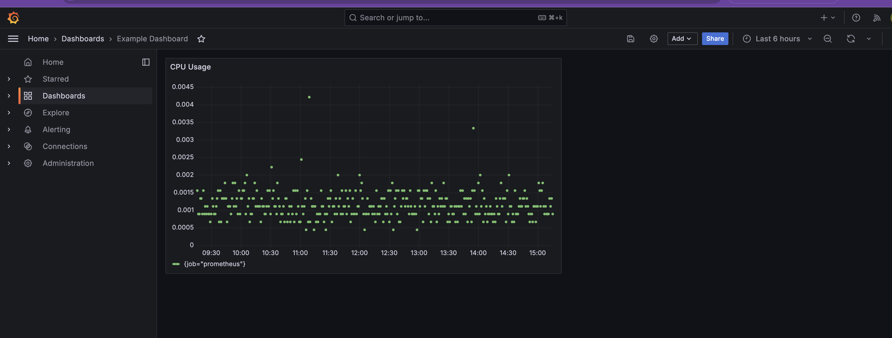

# Deploying Grafana in Minikube

## Table of Contents
- [Navigate to the Application Directory](#navigate-to-the-application-directory)
- [Overview](#overview)
- [Key Features of Grafana](#key-features-of-grafana)
- [Architecture](#architecture)
- [Use Cases](#use-cases)
- [Traditional Installation](#traditional-installation)
- [Grafana Installation Steps](#grafana-installation-steps)
  - [Step 1: Namespace Creation](#step-1-namespace-creation)
  - [Step 2: Grafana Deployment and Service](#step-2-grafana-deployment-and-service)
  - [Step 3: Configuring Prometheus as a Data Source](#step-3-configuring-prometheus-as-a-data-source)
  - [Step 4: Verifying the Configuration](#step-4-verifying-the-configuration)
- [Running the Playbook](#running-the-playbook)
- [Final Objective](#final-objective)
- [Cleanup](#cleanup)

---

## Navigate to the Application Directory

To begin, navigate to the directory for Exercise 6:

```bash
cd sre-abc-training/exercises/exercise6
```

> **Note**: This directory contains the necessary YAML files for the deployment and service configuration.

---

## Overview

Grafana is an open-source platform for monitoring and observability that provides powerful visualization and analysis capabilities. This exercise focuses on deploying Grafana in a Minikube cluster and integrating it with Prometheus (set up in Exercise 5).

> **Important**: Before proceeding, ensure that both Minikube and Podman are running. These were set up in previous exercises.

---

## Key Features of Grafana

- Customizable Dashboards with interactive visualizations.
- Integration with multiple data sources such as Prometheus, InfluxDB, and Elasticsearch.
- Advanced alerting and notification capabilities.
- User management and role-based access control.

---

## Architecture

Grafana's key components:
- **Dashboard**: Provides data visualization and analysis.
- **Data Sources**: Supports multiple data backends for metrics and logs.
- **Alerting**: Generates alerts based on configured rules and thresholds.

---

## Use Cases

- Real-time application monitoring.
- Infrastructure performance tracking.
- System health alerts and notifications.
- Metrics visualization from multiple data sources.

---

## Traditional Installation

To install Grafana traditionally:
1. Download the latest Grafana release from [Grafana Downloads](https://grafana.com/grafana/download).
2. Run the binary or install via a package manager.
3. Access Grafana on `http://localhost:3000` (default port).
4. Login using the default credentials (`admin/admin`).

In this exercise, we’ll deploy Grafana in a Minikube cluster using Kubernetes YAML configurations.

---

## Grafana Installation Steps

### Step 1: Namespace Creation

To isolate monitoring tools, the `grafana.yaml` file includes a namespace definition:
```yaml
apiVersion: v1
kind: Namespace
metadata:
  name: monitoring # Namespace for monitoring tools.
```

---

### Step 2: Grafana Deployment and Service

The `grafana.yaml` file also defines the Grafana deployment and service:

- **Deployment**:
```yaml
apiVersion: apps/v1
kind: Deployment
metadata:
  name: grafana-deployment
  namespace: monitoring
  labels:
    app: grafana
spec:
  replicas: 1
  selector:
    matchLabels:
      app: grafana
  template:
    metadata:
      labels:
        app: grafana
    spec:
      containers:
        - name: grafana
          image: grafana/grafana:latest
          ports:
            - containerPort: 3000
```

- **Service**:
```yaml
apiVersion: v1
kind: Service
metadata:
  name: grafana-service
  namespace: monitoring
  labels:
    app: grafana
spec:
  selector:
    app: grafana
  ports:
    - protocol: TCP
      port: 3000
      targetPort: 3000
  type: NodePort
```

---

### Step 3: Configuring Prometheus as a Data Source

The `grafana.yaml` file configures Prometheus as a data source:
```yaml
apiVersion: v1
kind: ConfigMap
metadata:
  name: grafana-config
  namespace: monitoring
  labels:
    app: grafana
data:
  datasources.yaml: |
    apiVersion: 1
    datasources:
      - name: Prometheus
        type: prometheus
        url: http://prometheus-service.monitoring.svc.cluster.local:9090
        access: proxy
        isDefault: true
```

---

### Step 4: Verifying the Configuration

Deploy the Grafana resources:
```bash
kubectl apply -f grafana.yaml
```

Verify the status of the pods in the `monitoring` namespace:
```bash
kubectl get pods -n monitoring
```

Access Grafana:
```bash
minikube service grafana-service -n monitoring
```

> **Expected Outcome**: After logging in with `admin/admin`, you should see the default Grafana interface. Navigate to **Configuration > Data Sources** to verify Prometheus is listed as the data source.

---

## Running the Playbook

To automate the deployment using Ansible:

1. **Clarify the Dependency**  
   Ensure Exercise 4.1 is complete and the `inventory.ini` file exists in `../exercise4.1/ansible_quickstart`.

2. **Run the Playbook**  
   Execute the playbook to deploy Grafana:
   ```bash
   ansible-playbook -i ../exercise4.1/ansible_quickstart/inventory.ini infra.yaml
   ```

3. **Verify Access**  
   Confirm that Grafana is accessible:
   ```bash
   minikube service grafana-service -n monitoring
   ```

---

## Final Objective

At the end of this exercise, you should accomplish the following:

> **Important**  
> Log in to Grafana using the default credentials (`admin/admin`) and verify:
> - Prometheus is configured as a data source.
> - Dashboards display metrics from Prometheus.
> - Example Dashboard with CPU Usage visualization is functional.

Example Dashboard:


---

## Cleanup

After completing the exercise, clean up the resources:

1. Delete the deployment and service:
   ```bash
   kubectl delete -f grafana.yaml
   ```

2. Verify that no resources remain:
   ```bash
   kubectl get pods -n monitoring
   ```
   Output:
   ```
   No resources found in monitoring namespace.
   ```

By following these steps, your environment will be ready for the next exercise.

---