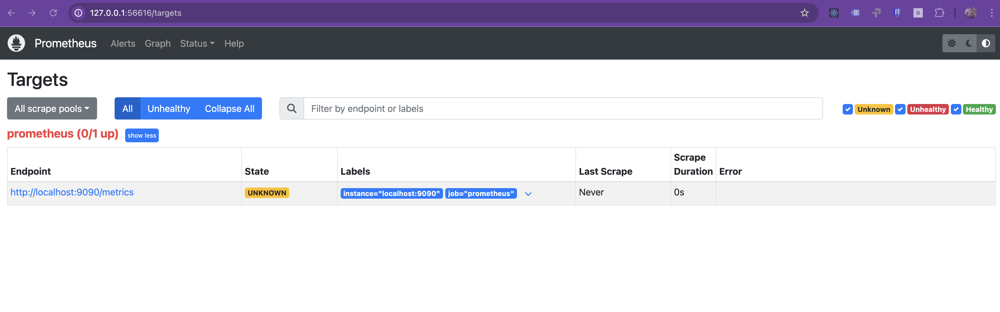

# Overview

This section will show how to extend the information in Prometheus to deploy a more robust dashboard in Grafana.

### 1. Check the Status of Prometheus
```yaml
minikube service prometheus-service -n monitoring
|------------|--------------------|-------------|---------------------------|
| NAMESPACE  |        NAME        | TARGET PORT |            URL            |
|------------|--------------------|-------------|---------------------------|
| monitoring | prometheus-service |        9090 | http://192.168.49.2:32065 |
|------------|--------------------|-------------|---------------------------|
🏃  Starting tunnel for service prometheus-service.
|------------|--------------------|-------------|------------------------|
| NAMESPACE  |        NAME        | TARGET PORT |          URL           |
|------------|--------------------|-------------|------------------------|
| monitoring | prometheus-service |             | http://127.0.0.1:56616 |
|------------|--------------------|-------------|------------------------|
```
Go to the **Targets** option at http://127.0.0.1:56616/targets, and you should only see the Python application displayed . 

### 2. Let´s install kube-state-metrics

**kube-state-metrics** is a service that listens to the Kubernetes API and generates metrics about the state of the objects within the cluster (e.g., Pods, Deployments, Nodes). It focuses on reflecting the current state of Kubernetes resources rather than measuring the performance of workloads or nodes.

Unlike other monitoring tools that measure performance metrics like CPU or memory usage, kube-state-metrics provides valuable insights into the health, status, and state of Kubernetes resources. It is typically used in conjunction with Prometheus to gather information about resource statuses, failures, and events.

##### Key Metrics Provided

- **Pods**: Track the status, readiness, and restart counts of containers in pods.
- **Deployments**: Monitor replica counts, available and unavailable replicas.
- **Nodes**: View node status, capacity, and conditions.
- **Services**: Keep an eye on service endpoints and related metrics.
- **Persistent Volumes**: Check volume status, capacity, and reclaim policies.

##### Installation Steps in Minikube

Follow these steps to install kube-state-metrics on a Minikube cluster:

###### 1. Get the settings
Download the basic configuration from the Github
```sh
git clone https://github.com/kubernetes/kube-state-metrics
```
###### 2. Install defaukt configuration
Install the basic configuration from the examples.
```sh
kubectl apply -k kube-state-metrics/examples/standard/
```

###### 3. Add extra configuratin to Prometheus
Add this extra settings to let Prometheus gather the metics from kube-state-metrics
```yaml
      - job_name: kube-state-metrics
        honor_timestamps: true
        scrape_interval: 1m
        scrape_timeout: 1m
        metrics_path: /metrics
        scheme: http
        static_configs:
        - targets:
          - kube-state-metrics.kube-system.svc.cluster.local:8080
```

### 3. Let´s install cAdvisor

**cAdvisor** (Container Advisor) is an open-source tool created by Google that provides resource usage and performance metrics for running containers. It collects, processes, and exports information about CPU, memory, network, and disk usage from containers, especially those managed by Docker. 

It is built directly into the Kubelet (the Kubernetes node agent) and is crucial for understanding the resource consumption of your containers, making it a key component in containerized environments.

###### Key Features

- **Real-time monitoring**: Collects real-time performance metrics from individual containers.
- **Resource usage statistics**: Tracks CPU, memory, filesystem, and network usage.
- **Per-container statistics**: Supports container-level granularity.
- **Built-in support for Docker**: Seamlessly integrates with Docker to monitor container stats.
- **Export data**:

##### Integration with Prometheus

**cAdvisor** integrates well with **Prometheus** to provide detailed container metrics. Prometheus scrapes metrics exposed by cAdvisor and stores them as time series data for analysis and alerting.

###### How It Works

1. **cAdvisor runs on each Kubernetes node**: Since cAdvisor is part of the Kubelet, it automatically collects metrics from containers on that node.
2. **cAdvisor exposes metrics on an HTTP endpoint**: It exposes metrics at `/metrics` (usually on port `8080`).
3. **Prometheus scrapes the cAdvisor endpoint**: Prometheus scrapes this endpoint to collect the metrics and store them in its time series database.
4. **Prometheus configuration**: You need to add cAdvisor as a scrape target in Prometheus to begin collecting metrics from it.

## How to Use cAdvisor with Prometheus

###### 1. Running cAdvisor

If you're running a Kubernetes cluster, cAdvisor is already built into the Kubelet, but you can also run cAdvisor as a standalone Docker container for a non-Kubernetes setup. Here's how to run cAdvisor on a Docker host:

```bash
docker run \
  --volume=/:/rootfs:ro \
  --volume=/var/run:/var/run:ro \
  --volume=/sys:/sys:ro \
  --volume=/var/lib/docker/:/var/lib/docker:ro \
  --publish=8080:8080 \
  --detach=true \
  --name=cadvisor \
  google/cadvisor:latest
```

Run this command with all the configuration

```sh
kubectl apply -f cadvisor.yaml
```

###### 2. Add extra configuratin to Prometheus
To integrate cAdvisor with Prometheus, you need to configure Prometheus to scrape cAdvisor’s metrics.

Add cAdvisor as a Prometheus scrape target:
In your prometheus.yml configuration file, add the following job definition:

```yaml
      - job_name: 'cadvisor'
        kubernetes_sd_configs:
          - role: pod
        relabel_configs:
          - source_labels: [__meta_kubernetes_pod_label_app]
            action: keep
            regex: cadvisor
        metrics_path: /metrics
        scheme: http
```


Run this command with all the configuration


```sh
kubectl apply -f cadvisor.yaml
```

### 4. Apply changes to Prometheus 

Finally, run the yaml file with all the changes together
```sh
kubectl delete -f prometheus.yaml
kubectl apply -f prometheus.yaml
minikube service prometheus-service -n monitoring
```

And the **Targets** option at http://127.0.0.1:56616/targets should look like this
. 