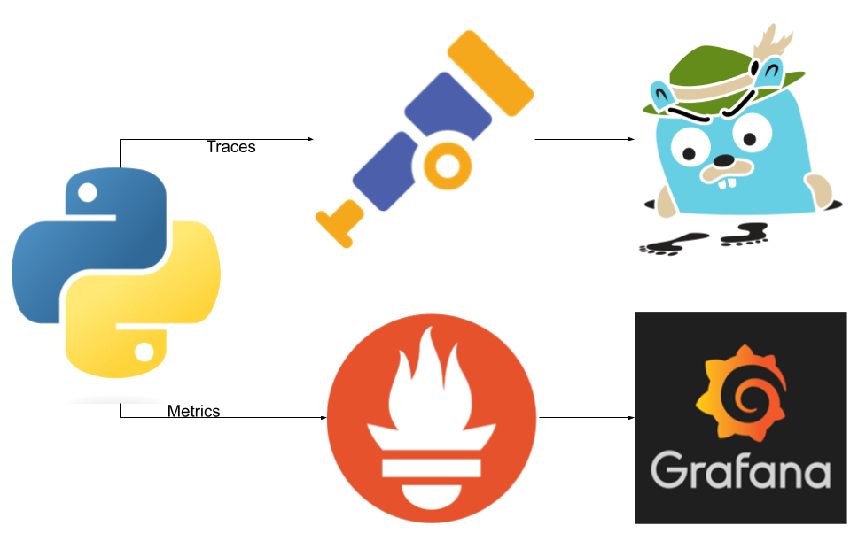

# Overview

In this exercise, we will modify a Python application to generate traces by adding some configuration to the OpenTelemetry Collector (OtelCollector). This will instrument the code to produce traces once the application is running. These traces will then be sent to the OtelCollector, and subsequently, they will be displayed in Jaeger.

## What is the OpenTelemetry Collector?

The OpenTelemetry Collector is a highly configurable component that receives, processes, and exports telemetry data (metrics, traces, and logs) from multiple sources. It acts as a bridge between instrumented applications and observability backends, like Jaeger or Prometheus.

### How does the OpenTelemetry Collector work?

The OtelCollector can be deployed as an agent or a gateway. It receives telemetry data from applications that use OpenTelemetry instrumentation. The data is processed through pipelines, which can include processors, and then exported to a designated backend for visualization or analysis. 

For example, an application can generate trace data, which the collector processes and sends to Jaeger, where the traces can be viewed and analyzed.

## What is Jaeger?

Jaeger is a distributed tracing platform designed for monitoring and troubleshooting microservices-based architectures. It allows users to trace requests as they propagate through various services, providing insights into performance bottlenecks, latency, and errors.

### How does Jaeger work?

Jaeger collects and stores trace data from applications, which is later visualized through its UI. This trace data helps developers understand how requests flow through services, identify slow services, and diagnose distributed system issues. Jaeger works by collecting span data, where each span represents a unit of work in a trace. Spans are linked together to form a complete trace of a request.

## Steps to Set Up

1. **Configure OpenTelemetry in the Python application**:
   - Install the necessary OpenTelemetry packages for Python.
   - Configure the application to generate traces.
   
2. **Set up the OpenTelemetry Collector**:
   - Configure the OtelCollector to receive traces from the application.
   - Define an export pipeline to send traces to Jaeger.
   
3. **Deploy Jaeger**:
   - Ensure Jaeger is running and configured to receive traces from the OtelCollector.
   - Use Jaeger's UI to visualize traces.

By following these steps, you will have a Python application instrumented with OpenTelemetry, sending traces to Jaeger for monitoring and troubleshooting.




## 1. Let´s add the configuration code in to the python application

### Python Application Instrumentation with OpenTelemetry

In this example, we will extend a Python application by adding OpenTelemetry tracing configuration to instrument the code and generate traces. These traces will be sent to the OpenTelemetry Collector and then visualized in Jaeger. Additionally, we will implement a function that simulates request processing with occasional delays and exceptions.

#### Adding OpenTelemetry Tracing to the Python Application

To instrument your Python application with OpenTelemetry, you will add the following code block to set up tracing:

```python
# Set up OpenTelemetry tracing with service name
resource = Resource.create({"service.name": "sre-abc-training-app"})  # Replace with your service name

span_exporter = OTLPSpanExporter(
    endpoint="otel-collector.opentelemetry.svc.cluster.local:4317",  # Update with your OTEL Collector endpoint
    insecure=True  # Set to True if using an unencrypted connection
)

tracer_provider = TracerProvider(resource=resource)
span_processor = BatchSpanProcessor(span_exporter)
tracer_provider.add_span_processor(span_processor)
trace.set_tracer_provider(tracer_provider)

# Get tracer
tracer = trace.get_tracer(__name__)
```

##### Explanation of the Code

- **Resource**: Defines the service that will generate the telemetry data. Here, `"service.name": "sre-abc-training-app"` sets the service name. This name will appear in your trace data and helps identify which service or component the traces belong to.

- **OTLPSpanExporter**: This exporter sends spans (trace data) to the OpenTelemetry Collector. The `endpoint` points to the collector's address, and `insecure=True` specifies that an unencrypted connection will be used.

- **TracerProvider**: This is the central component that manages tracers. By setting a resource and adding a span processor, we enable the application to generate and export trace data.

- **BatchSpanProcessor**: Collects spans in batches before sending them to the collector. This improves performance compared to sending spans individually.

- **Tracer**: Represents the instrumentation part of the code. The `tracer` object is used to create spans for each unit of work that you want to trace within your application.


#### Simulating a Workload with Tracing
We will also add a function foo, which calls another function goo that will generate an exception every 5 requests. Additionally, foo will call a function zoo that introduces random processing delays between 0 and 5 seconds.
```python
import random
import time

def zoo():
    # Simulate random processing time between 0 and 5 seconds
    delay = random.uniform(0, 5)
    time.sleep(delay)
    return "Zoo function completed."

def goo():
    # Raise an exception every 5 requests
    if random.randint(1, 5) == 5:
        raise Exception("Error in goo: Simulated exception.")
    return "Goo function completed."

def foo():
    try:
        result_goo = goo()
        print(result_goo)
    except Exception as e:
        print(f"Exception in goo: {e}")
    
    result_zoo = zoo()
    print(result_zoo)
```
##### Explanation of the Functions:
- **foo**: Calls the goo and zoo functions and handles any exceptions raised by goo. This function simulates a workload that generates traceable events, such as successful function calls, delays, and errors.

- **goo**: Raises an exception once every 5 requests. This helps simulate error handling within the application, which can be visualized in the traces to monitor failure points.

- **zoo**: Introduces a random delay between 0 and 5 seconds to simulate variable processing times. This can help visualize latency in the application's execution when viewed in Jaeger.

#### Push Images

   - You can now push images to this repository using Podman commands from your terminal. For example:

 
   ```bash
   podman login docker.io
   podman tag local-image-name username/repository-name:tag
   podman push username/repository-name:tag
   ```
   At least for demostration purposes this is my personal registry with this image
 
   ```bash
   podman login docker.io
   podman build -t cguillenmendez/sre-abc-training-python-app:latest .
   podman build -t cguillenmendez/sre-abc-training-python-app:0.0.1 .
   podman push cguillenmendez/sre-abc-training-python-app:latest
   podman push cguillenmendez/sre-abc-training-python-app:0.0.1
   ```

Checkout there is a new version of the code `cguillenmendez/sre-abc-training-python-app:0.0.1`


## 2. Installing the OpenTelemetry Collector for Sending Traces to Jaeger

In this section, we will install the OpenTelemetry Collector (OtelCollector) to send traces to Jaeger. The OtelCollector acts as a middleware between your instrumented application and Jaeger, facilitating the collection and export of telemetry data. We will configure the OtelCollector with a specific exporter and service setup.

## Steps to Install the OpenTelemetry Collector

1. **Create a Configuration File**:
   We need to define how the OtelCollector will operate by creating a configuration file. This file will specify the exporters and services that the collector will use.

   Here’s an example configuration file (`otel-collector-config.yaml`):

   ```yaml
   receivers:
     otlp:
       protocols:
         grpc:
           endpoint: "0.0.0.0:4317"

   exporters:
     jaeger:
       endpoint: "jaeger:4317"  # Update to use the correct Jaeger endpoint
       tls:
         insecure: true  # Set to true if you are using an unencrypted connection

   service:
     pipelines:
       traces:
         receivers: [otlp]
         exporters: [jaeger]
 ```
 For more details check (`otel-collector.yaml`):