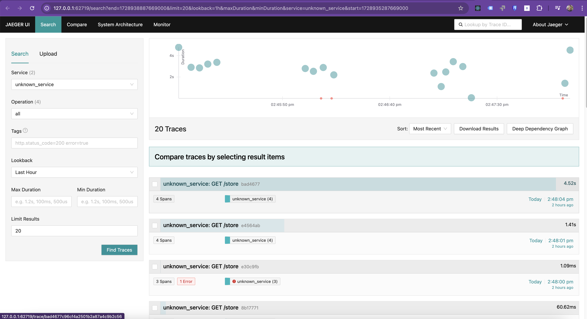
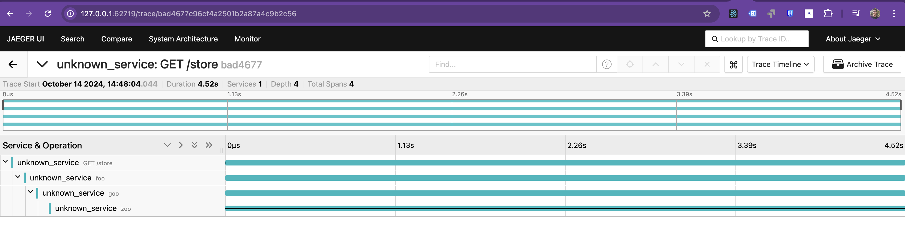
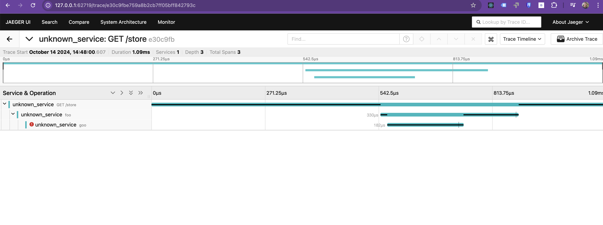

## **Table of Contents**
 - [Overview](#overview)
 - [Navigate to the Directory](#navigate-to-the-directory)
 - [Steps to Set Up](#steps-to-set-up)
 - [Deployment](#deployment)
 - [Tip for Infrastructure as Code (IaC) with Ansible](#tip-for-infrastructure-as-code-iac-with-ansible)
 - [Final Objective](#final-objective)
 - [Cleanup](#cleanup)

---

## **Overview**
In this exercise, you will instrument a **Python application** to generate traces and send them to an **OpenTelemetry Collector (OtelCollector)**, which then forwards them to **Jaeger for visualization**. This enables **end-to-end tracing**, allowing you to analyze request flow, identify bottlenecks, and detect errors.

### **What is OpenTelemetry?**
OpenTelemetry is a framework for collecting, processing, and exporting telemetry data (metrics, traces, logs) from applications. The **OpenTelemetry Collector** acts as an intermediary that receives traces and sends them to backends like Jaeger.

### **What is Jaeger?**
Jaeger is a distributed tracing platform used to **monitor microservices-based applications**. It helps **identify bottlenecks, latency issues, and system failures** by visualizing traces from different services.

---

## **Navigate to the Directory**
Before starting, ensure you are in the correct directory:

```bash
cd sre-abc-training/exercises/exercise8
```

---

## **Required Files**
The necessary files for this exercise are already included in the repository.  
You do **not** need to create them manually.  

Files included:
- `otel-collector.yaml`: Configuration for the OpenTelemetry Collector.
- `jaeger.yaml`: Deployment configuration for Jaeger.
- `deployment.yaml`: Deployment configuration for the Python application.
- `app.py`: The instrumented Python application.
- `Dockerfile`: The containerization script for the Python application.

---

## **1. Instrumenting the Python Application**
### **Modify the Python Application for Tracing**
To enable tracing in the Python application:

1. The required **OpenTelemetry libraries** are already included in the `Dockerfile`:

   ```docker
   RUN pip install flask \
       opentelemetry-api \
       opentelemetry-sdk \
       opentelemetry-exporter-otlp-proto-grpc \
       opentelemetry-instrumentation-flask
   ```

2. The **Python application** is already instrumented to initialize OpenTelemetry tracing inside `app.py`:

   ```python
   from opentelemetry import trace
   from opentelemetry.exporter.otlp.proto.grpc.trace_exporter import OTLPSpanExporter
   from opentelemetry.sdk.resources import Resource
   from opentelemetry.sdk.trace import TracerProvider
   from opentelemetry.sdk.trace.export import BatchSpanProcessor

   # Define the service name
   resource = Resource.create({"service.name": "sre-abc-training-app"})

   # Set up the OpenTelemetry Collector endpoint
   span_exporter = OTLPSpanExporter(
       endpoint="otel-collector.opentelemetry.svc.cluster.local:4317",
       insecure=True
   )

   # Configure the tracer provider and processor
   tracer_provider = TracerProvider(resource=resource)
   span_processor = BatchSpanProcessor(span_exporter)
   tracer_provider.add_span_processor(span_processor)
   trace.set_tracer_provider(tracer_provider)

   # Get a tracer instance
   tracer = trace.get_tracer(__name__)
   ```

---

## **2. Deploying the OpenTelemetry Collector**
The **OtelCollector** will collect traces from the Python application and forward them to Jaeger.

1. Apply the **OtelCollector** deployment:

   ```bash
   kubectl apply -f otel-collector.yaml
   ```

2. Verify that the pod is running:

   ```bash
   kubectl get pods -A | grep otel-collector
   ```

---

## **3. Deploying Jaeger**
Jaeger is used to visualize traces.

1. Apply the **Jaeger** deployment:

   ```bash
   kubectl apply -f jaeger.yaml
   ```

2. Verify that Jaeger is running:

   ```bash
   kubectl get pods -n opentelemetry
   ```

3. Access the **Jaeger UI**:

   ```bash
   minikube service jaeger -n opentelemetry
   ```

---

## **4. Running the Application**
Now that everything is deployed, you can start the instrumented **Python application**.

1. Apply the deployment:

   ```bash
   kubectl apply -f deployment.yaml
   ```

2. Check the status of the pods:

   ```bash
   kubectl get pods -A
   ```

---

## **5. Automating with Ansible (Optional)**
To automate the deployment process, you can use an **Ansible playbook**.

This playbook is already included in the repository and applies all required configurations:

```yaml
---
- name: Deploy OpenTelemetry Stack
  hosts: all
  become: yes
  tasks:
    - name: Apply OpenTelemetry Collector
      command: kubectl apply -f otel-collector.yaml

    - name: Apply Jaeger
      command: kubectl apply -f jaeger.yaml

    - name: Deploy Application
      command: kubectl apply -f deployment.yaml
```

Run the playbook:

```bash
ansible-playbook -i inventory.ini deploy.yaml
```

---

## **Final Objective**
By completing this exercise, you will have:
✅ Instrumented a Python application with OpenTelemetry  
✅ Configured and deployed the OpenTelemetry Collector  
✅ Deployed Jaeger to visualize traces  
✅ Automated the process using Ansible (optional)  

### **Expected Results in Jaeger UI**
- **Trace Dashboard**: Shows received traces from the Python application  
    

- **Viewing a Specific Trace**  
    

- **Tracing an Error**  
    

---

## **Cleanup**
To free up resources, **delete the deployed components**:

```bash
kubectl delete -f deployment.yaml
kubectl delete -f otel-collector.yaml
kubectl delete -f jaeger.yaml
```

If using Minikube, stop the cluster:

```bash
minikube stop
```

---