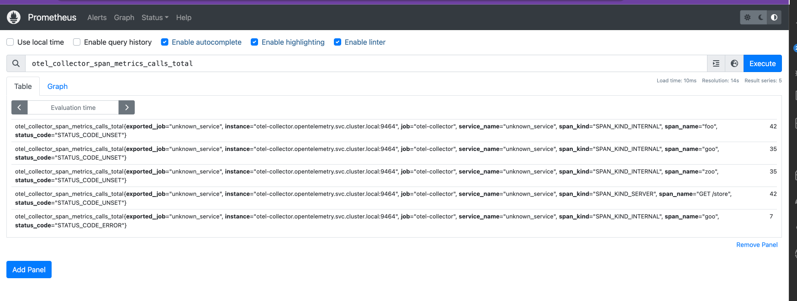
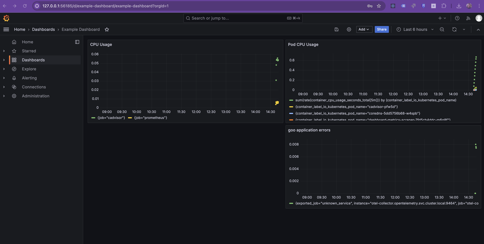

# Generating Trace-Based Metrics Using OpenTelemetry and Prometheus

## **Table of Contents**  

- [Overview](#overview)  
- [Navigate to the Directory](#navigate-to-the-directory)  
- [Configuring OpenTelemetry Collector for Trace-Based Metrics](#configuring-opentelemetry-collector-for-trace-based-metrics)  
   - [Steps Overview](#steps-overview)  
   - [SpanMetrics Connector](#spanmetrics-connector)  
   - [Example Configuration for OpenTelemetry Collector](#example-configuration-for-opentelemetry-collector)  
     - [Key Configuration Components](#key-configuration-components)  
   - [Exporting Metrics to Prometheus](#exporting-metrics-to-prometheus)  
   - [Build a Dashboard in Grafana Using the New Metrics](#build-a-dashboard-in-grafana-using-the-new-metrics)  
- [Deployment](#deployment)  
- [Tip for Infrastructure as Code (IaC) with Ansible](#tip-for-infrastructure-as-code-iac-with-ansible)  
- [Final Objective](#final-objective)
- [Cleanup](#cleanup)

---

## **Overview**  

In this exercise, we will configure the **OpenTelemetry Collector** to generate trace-based metrics from a Python application and send them to **Prometheus**. These metrics will then be visualized using **Grafana** to help monitor request count, error count, and request duration.  

The key components involved in this exercise are:  
- **OpenTelemetry Collector**: A middleware for receiving, processing, and exporting telemetry data.  
- **SpanMetrics Connector**: Converts span (trace) data into structured metrics.  
- **Prometheus**: A monitoring system that collects time-series metrics.  
- **Grafana**: A visualization tool for creating dashboards from Prometheus metrics.  

By the end of this exercise, you will be able to track application performance metrics derived from traces, enhancing observability and monitoring capabilities.  


---

## **Navigate to the Directory**  

Before proceeding with the steps, navigate to the correct directory using:  

```bash
cd sre-abc-training/exercises/exercise9
```

The required files for this exercise are already included in the directory. You do not need to create them manually.

---

## **Configuring OpenTelemetry Collector for Trace-Based Metrics**  

### **Steps Overview**  

1. **Install and Configure the SpanMetrics Connector**: Converts span (trace) data into structured metrics.  
2. **Configure the OpenTelemetry Collector**: Defines how traces are processed and converted into metrics.  
3. **Export Metrics to Prometheus**: Sends the generated metrics for monitoring.  
4. **Visualize Metrics in Grafana**: Creates a dashboard to display the extracted trace-based metrics.  

---

### **SpanMetrics Connector**  

The `spanmetricsconnector` in OpenTelemetry allows span (trace) data to be converted into useful metrics. It tracks:  
- **Request Count**: Total number of requests received.  
- **Error Count**: Total number of errors encountered.  
- **Request Duration**: Measures latency across different operations.  

---

### **Example Configuration for OpenTelemetry Collector**  

Modify the `otel-collector.yaml` file to enable the SpanMetrics Connector and configure Prometheus as the exporter.  

```yaml
apiVersion: v1
kind: ConfigMap
metadata:
  name: otel-config
  namespace: opentelemetry
data:
  config.yaml: |
    exporters:
      prometheus:
        endpoint: "0.0.0.0:9464"
        namespace: "otel_collector"

    connectors:
      spanmetrics:
        namespace: span.metrics

    service:
      pipelines:
        traces:
          receivers: [otlp]
          processors: [batch]
          exporters: [otlp/jaeger, spanmetrics]
        metrics:
          receivers: [otlp, spanmetrics]
          exporters: [prometheus]
```

### **Key Configuration Components**  

- **Receivers**: Collect telemetry data from the application.  
- **Processors**: Batch processing for efficiency.  
- **Exporters**:  
  - `spanmetrics`: Converts spans into structured metrics.  
  - `prometheus`: Sends the metrics to Prometheus.  
- **Pipelines**: Define how data flows from receivers to exporters.  

---

### **Exporting Metrics to Prometheus**  

Modify the `prometheus.yaml` configuration to scrape metrics from the OpenTelemetry Collector.  

```yaml
- job_name: 'otel-collector'
  scrape_interval: 15s
  static_configs:
    - targets: ['otel-collector.opentelemetry.svc.cluster.local:9464']
```

Verify that Prometheus is collecting the new trace-based metrics:  

```bash
minikube service prometheus-service -n monitoring
```

Open Prometheus UI and search for metrics with the prefix **otel_collector_span**.  

  

---

### **Build a Dashboard in Grafana Using the New Metrics**  

Create a new **Grafana panel** using the metric `otel_collector_span_metrics_calls_total`. Filter results to display only errors in the `goo` function:  

```yaml
{
  "datasource": "Prometheus",
  "targets": [
    {
      "expr": "rate(otel_collector_span_metrics_calls_total{span_name=\"goo\", status_code=\"STATUS_CODE_ERROR\"}[5m])",
      "refId": "C"
    }
  ],
  "title": "goo application errors",
}
```

This will generate a visualization of error rates.  

  

---

## **Deployment**  

Before deploying the new configuration, clean up previous exercise components and apply the new settings.  

```bash
#!/bin/bash
kubectl delete ns application opentelemetry monitoring
sleep 5
kubectl apply -f ../exercise8/deployment.yaml
kubectl apply -f ./otel-collector.yaml
kubectl apply -f ../exercise8/jaeger.yaml
kubectl apply -f ./prometheus.yaml
kubectl apply -f ./grafana.yaml
```

---

## **Tip for Infrastructure as Code (IaC) with Ansible**  

To automate the cleanup and deployment process, use the following **Ansible playbook**:  

```yaml
---
- name: Automate Kubernetes Cleanup and Deployment
  hosts: all
  gather_facts: no

  tasks:
    - name: Delete namespaces
      command: kubectl delete ns application opentelemetry monitoring
      ignore_errors: yes

    - name: Wait for cleanup
      wait_for:
        timeout: 5

    - name: Apply new configurations
      command: kubectl apply -f {{ item }}
      loop:
        - ../exercise8/deployment.yaml
        - ./otel-collector.yaml
        - ../exercise8/jaeger.yaml
        - ./prometheus.yaml
        - ./grafana.yaml
```

Run the playbook:  

```bash
ansible-playbook -i ../exercise4.1/ansible_quickstart/inventory.ini infra.yaml
minikube service grafana-service -n monitoring
```

---

## **Final Objective**  

By completing this exercise, you should be able to visualize trace-based metrics in **Grafana** using **Prometheus** as the data source.  

> [!IMPORTANT]  
> - View trace-based metrics in **Prometheus**.  
> - Build a Grafana dashboard using **otel_collector_span** metrics.  
> - Gain insights into application performance and error rates.  

  

---

## **Cleanup**

To remove deployed resources and free up cluster resources, execute the following cleanup commands:

```bash
kubectl delete -f ../exercise8/deployment.yaml
kubectl delete -f ./otel-collector.yaml
kubectl delete -f ../exercise8/jaeger.yaml
kubectl delete -f ./prometheus.yaml
kubectl delete -f ./grafana.yaml
kubectl delete ns application opentelemetry monitoring
```

This ensures that any deployed workloads are properly removed, preventing unnecessary resource consumption.

---