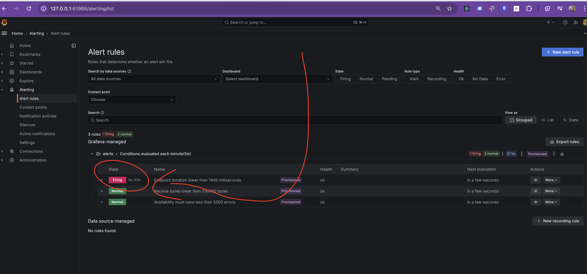
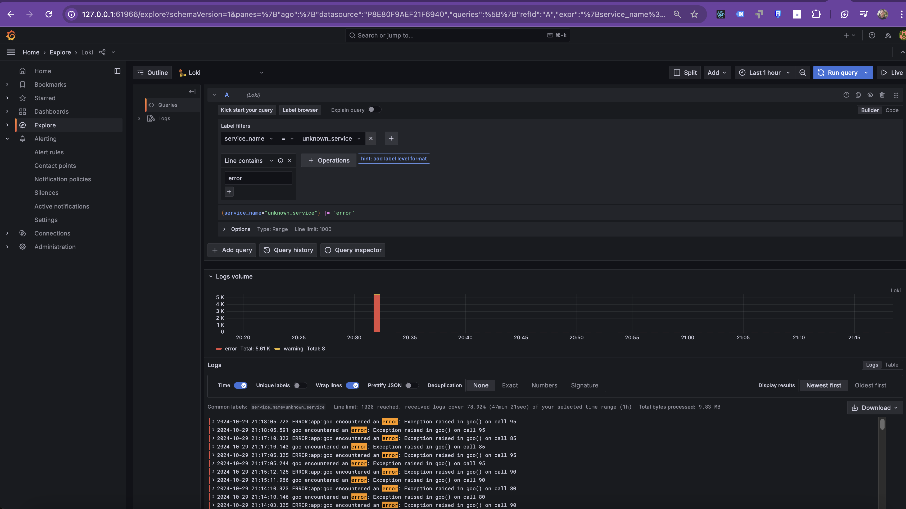

# **Understanding Time to Detect, Time to Acknowledge, and Time to Resolve in SRE**

## **Table of Contents**
1. [Overview](#overview)  
2. [Key Metrics in Incident Management](#key-metrics-in-incident-management)  
   - [Time to Detect (TTD)](#time-to-detect-ttd)  
   - [Time to Acknowledge (TTA)](#time-to-acknowledge-tta)  
   - [Time to Resolve (TTR)](#time-to-resolve-ttr)  
3. [Why These Metrics Matter in SRE](#why-these-metrics-matter-in-sre)  
4. [Tracking and Improving These Metrics](#tracking-and-improving-these-metrics)  
5. [Example Incident Workflow](#example-incident-workflow)  
6. [Decision-Making Based on Performance Metrics](#decision-making-based-on-performance-metrics)  

---

## **Overview**

In **Site Reliability Engineering (SRE)**, incident management effectiveness is measured using three key metrics:  

- **Time to Detect (TTD)** – How quickly an issue is detected.  
- **Time to Acknowledge (TTA)** – How quickly the team responds once an alert is raised.  
- **Time to Resolve (TTR)** – How quickly the issue is fully resolved and services return to normal.  

These are **team performance metrics**, not product metrics. They focus on how well the **incident response team** detects, acknowledges, and resolves incidents rather than the product's inherent stability.  

### **Incident Response Flow:**
```
Issue Occurs → Monitoring Detects Issue (TTD) → Alert is Raised → Engineer Acknowledges Issue (TTA) →  
Troubleshooting Begins → Issue is Resolved (TTR) → System Back to Normal  
```

---

## **Key Metrics in Incident Management**

### **Time to Detect (TTD)**  

- **Definition**: The time between an incident occurring and it being detected by monitoring tools.  
- **Goal**: Minimize TTD by improving monitoring and alerting mechanisms.  
- **Performance Metrics**:
  - **Monitoring Coverage**: Ensure all critical services are instrumented with metrics.  
  - **Alerting Latency**: Measure how quickly alerts are generated after an issue occurs.  

> **Example:**  
> If a backend service starts experiencing high latency at **10:00 AM**, but the monitoring system doesn’t detect it until **10:05 AM**, then the TTD is **5 minutes**.

### **Time to Acknowledge (TTA)**  

- **Definition**: The time between an alert being raised and an engineer acknowledging it.  
- **Goal**: Reduce TTA by ensuring a fast and efficient on-call response process.  
- **Performance Metrics**:
  - **Response Time**: Track the average time taken to acknowledge alerts.  
  - **On-Call Effectiveness**: Ensure clear rotations and escalation procedures.  

> **Example:**  
> If an alert is generated at **10:05 AM** and an engineer acknowledges it at **10:08 AM**, then the TTA is **3 minutes**.

### **Time to Resolve (TTR)**  

- **Definition**: The time between acknowledging an incident and fully resolving it.  
- **Goal**: Minimize TTR by streamlining troubleshooting and remediation.  
- **Performance Metrics**:
  - **Mean Time to Resolve (MTTR)**: The average resolution time across incidents.  
  - **Incident Analysis**: Identify root causes to prevent recurrence.  

> **Example:**  
> If an engineer starts working on the issue at **10:08 AM** and resolves it by **10:30 AM**, then the TTR is **22 minutes**.

---

## **Why These Metrics Matter in SRE**
Understanding and optimizing **TTD, TTA, and TTR** helps teams:  

- **Improve system reliability** – Faster response means less downtime and better user experience.  
- **Identify weak points in monitoring** – If an issue is detected too late, monitoring needs improvement.  
- **Enhance operational efficiency** – Reducing time spent on incidents leads to higher productivity.  

### **Impact of High vs. Low TTD, TTA, TTR**
| **Metric** | **High Value (Bad)** | **Low Value (Good)** |
|------------|----------------------|----------------------|
| **TTD** | Delayed detection, increased downtime. | Faster detection, quicker response. |
| **TTA** | Slow acknowledgment, incident lingers. | Immediate acknowledgment, quicker action. |
| **TTR** | Long resolution times, high user impact. | Fast resolution, improved reliability. |

---

## **Tracking and Improving These Metrics**
To measure **TTD, TTA, and TTR**, use **observability tools** such as **Prometheus, Grafana, Kibana**, or a dedicated incident management platform like **PagerDuty**.

### **Example Grafana Dashboard**
A **Grafana Alert** is triggered, showing an increase in **application errors**.



> **How to reduce TTD?**  
> Improve alert rules to detect anomalies faster.

---

## **Example Incident Workflow**

1. **Alert is triggered**:  
   - The monitoring system detects an issue and generates an alert.
   - An on-call engineer receives a PagerDuty notification.

2. **Acknowledge the issue (TTA)**:  
   - The engineer acknowledges the alert within **5 minutes**.

3. **Troubleshooting (TTR begins)**:  
   - Logs show **high error rates** in the application.  
   - The engineer finds a **failed container** causing issues.  

   

4. **Apply a fix**:  
   - The engineer restarts the service using **kubectl**:

5. **Verify resolution**:  
   - Logs show **normal response times**.  
   - Error rates drop to acceptable levels.  

6. **Postmortem Analysis**:  
   - The team documents the incident to improve future response times.

---

## **Decision-Making Based on Performance Metrics**

To improve **TTD, TTA, and TTR**, teams should:

| **Strategy**            | **Impact** |
|-------------------------|-----------|
| **Better Monitoring**   | Reduces **TTD** by detecting issues earlier. |
| **On-Call Optimization** | Reduces **TTA** by ensuring faster acknowledgment. |
| **Incident Automation** | Reduces **TTR** by automating response actions. |
| **Postmortems**         | Helps refine future incident responses. |

---